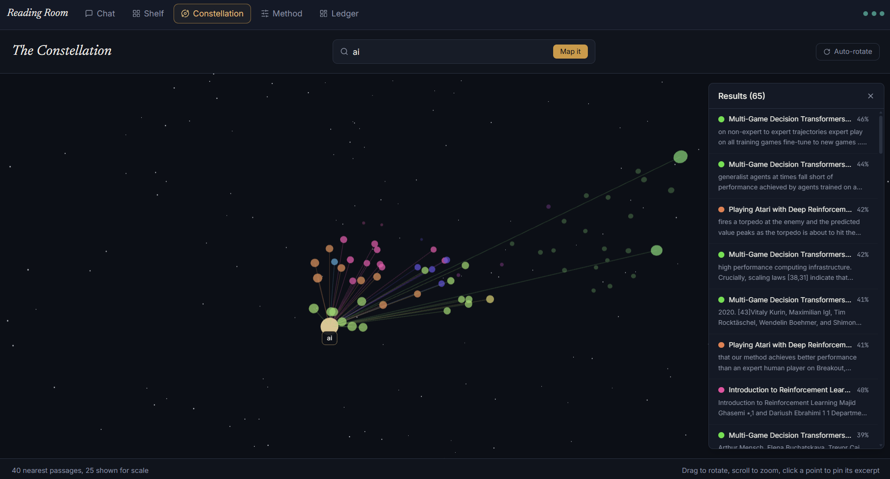
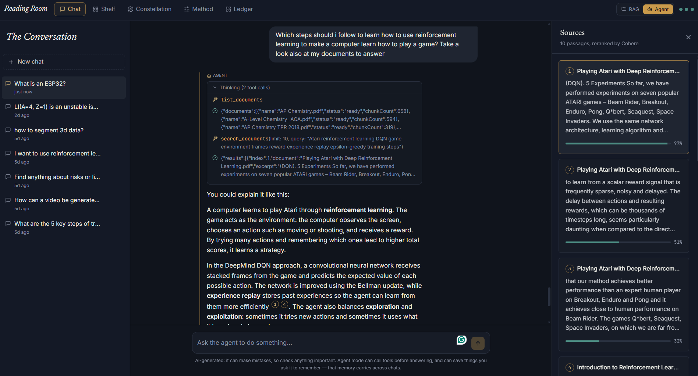

# Reading Room — RAG & Agent document Q&A

A Next.js app that lets you upload documents (PDF, DOCX, TXT, MD, CSV) and
ask questions about them in a chat interface, in either of two modes: plain
RAG (retrieve, then answer) or an Agent mode that can call tools, document
search, web search, a calculator, persistent memory, and any custom API you
add, in a loop before answering. Every answer is grounded and citable,
every LLM call and every stage of producing it is timed and recorded, and
you have full control over which pipeline steps cost an API call and which
model runs them.

## Features

### Navigation

A top navbar links Chat, Shelf, Constellation,
Settings, and the Ledger, with a RAG/Agent mode toggle and the usage rings
always visible on the right. The left sidebar only shows on the Chat page
and is reserved entirely for switching between conversations.

### 💬 Chat — "The Conversation"


- **Ask questions in plain language;** answers stream in token-by-token with
  inline citations like `[1]`, `[2]` — click one (or the source chip under
  the answer) to open the **Sources panel**, which shows the exact passage,
  its source document, and a relevance bar.
- **Every answer shows how long it took and how many LLM calls that took.**
  A small badge row under each assistant message reads e.g. "Agent",
  "3 LLM calls", "2.4s" as separate elements, deliberately just the
  total, not a full per-stage breakdown (that level of detail lives on the
  Ledger's [Timing](#timing) charts instead).
- **Math, chemistry, and nuclear notation render properly** (via
  `remark-math` + `rehype-katex`/KaTeX) instead of showing raw LaTeX source
  — a model output like `\(^{4}_{3}\mathrm{Li}\)` renders as an actual
  isotope symbol. The
  system prompt asks the model for `$...$`/`$$...$$` delimiters, and
  `\(...\)`/`\[...\]` are normalized to that automatically as a fallback,
  since plain CommonMark otherwise mangles raw LaTeX badly (it silently
  strips backslashes before punctuation, and underscore subscripts collide
  with markdown's emphasis syntax).
- **Tables, strikethrough, and task lists render properly** too (via
  `remark-gfm`) — plain CommonMark (what's left without it) doesn't support
  pipe-table syntax at all, so a markdown table would otherwise render as
  one long run-on paragraph with literal `|` characters, since HTML
  collapses the newlines between rows inside a plain `<p>`. Wide tables
  scroll horizontally instead of squeezing columns unreadably on narrow
  chat widths.
- While an answer is being produced, a live stage indicator shows exactly
  where the pipeline is: reading the question → searching the shelf →
  ranking passages → writing the answer (RAG), or a live "Thinking" panel
  of tool calls as they happen (Agent).
- **Multiple chats**, each with its own persisted history in Postgres —
  switch between them from the "Chats" tab in the sidebar.
- **Pin** chats you want to keep at the top, **rename** any chat by
  double-clicking its title, **delete** with a confirmation prompt.
- **Compaction**: once a chat passes ~24 messages, everything except the
  most recent few is folded into a running summary (one extra LLM call), so
  long conversations don't keep growing the context sent to the model on
  every turn. The full transcript still displays in the UI — only the
  model's context is compacted.

### 📚 Documents — "The Shelf"


A page with documents shown as tiles in a
responsive grid:

- Drag-and-drop or pick files (PDF, DOCX, TXT, MD, CSV) from the upload
  zone at the top. Each upload streams live progress: reading → chunking →
  embedding → storing.
- Each tile shows a status badge (processing / ready / failed), passage
  count and extracted character count once ready, file type, and upload
  time.
- **Filter** by name (search box), status, or file type (type filters only
  appear once more than one type is present); **sort** by newest, oldest,
  name, most passages, or most text.
- **Rename** a document by double-clicking its name on the tile; **delete**
  it (and all its chunks, cascaded) with the trash icon.
- **"Group similar"** clusters documents by how alike their content
  actually is — there's no taxonomy to
  classify into, only which documents read as similar to which others. Each
  document gets a centroid embedding (the elementwise mean of its chunks'
  embeddings, computed once when it finishes processing); pairwise
  similarity between every pair of centroids is computed in SQL with
  pgvector's cosine distance operator, then documents are grouped via
  union-find using an **adaptive threshold**: pairs more than one
  standard deviation above this particular document set's own mean
  similarity, not a fixed cosine number. Group
  labels are generated locally too: the top significant terms (via the
  same `wink-nlp` tokenizer/lemmatizer already used for local reranking)
  across a sample of each group's content. Documents not
  similar enough to anything else land in a "Not similar to others"
  section rather than being forced into a group.

### 📊 Dashboard — "The Ledger"


- **Database**: documents ready/total, passages (chunks) stored, total
  extracted text, and answers generated all-time.
- **API usage**, tracked per provider (OpenRouter, Cohere, local
  embeddings) with calls today / this month / all-time and tokens used —
  each shown against that provider's free-tier limits, with a pencil icon
  to edit those limits directly if a provider changes theirs.
- **Passage usage**: a searchable grid of every chunk across every
  document, with a bar showing how many times it's actually been pulled
  into an answer's context: useful for spotting documents nobody's
  questions ever touch.
- **Tool usage** (Agent mode): calls, success rate, and last-used time per
  tool, built-in or custom.
- **Timing**, with real charts: average total turn time up top, a 14-day
  daily-average trend line, and a bar breakdown of every measured stage —
  query optimization, retrieval, reranking, answer generation for RAG mode;
  each LLM round-trip and each individual tool call (`tool:search_documents`,
  `tool:web_search`, etc.) for Agent mode, with average/min/max duration
  and call count for each. Every one of those is a real, persisted
  measurement, not an estimate (see [Timing](#timing) below).
- Small progress rings in the top navbar give an at-a-glance usage status per provider: teal = fine,
  brass = getting close, rust = near the limit, dim = not configured.

### 🌌 Embedding space — "The Constellation"



Enter any word or phrase and see it mapped in 3D alongside the passages
closest to it in embedding space, plus a handful of unrelated passages
shown for scale/contrast. Lines connect the query to its nearest neighbors;
hover or click a point for its excerpt and similarity score. Built with
`three.js` / `@react-three/fiber`, with the 384-dimension embeddings
projected down to 3D via UMAP (falls back to a simple radial layout if
there are too few passages for UMAP's neighbor graph to be meaningful, e.g.
right after your first upload).

- **Color per document**: each document gets a maximally-distinct hue via
  golden-angle stepping (the same spacing trick used for evenly splitting a
  circle, e.g. sunflower seed heads). Colors are
  assigned in upload order and fetched once, so a document keeps the same
  color across different searches.
- **Results panel**: a collapsible overlay (top-right, click to expand or
  collapse) lists every plotted passage sorted by similarity, with its
  document's color dot and a percentage. Clicking a row pins that point's
  tooltip open in the 3D view, and vice versa.

### ⚙️ Settings — "The Method"

Organized into four tabs rather than one long scroll, General, Agent,
Memory, and Danger zone.

- **General**: the model (a searchable list of every current free
  OpenRouter model, each flagged with a green "Tools" badge if it supports
  function calling, plus a manual text field to pin any model id directly
  — this one setting controls every OpenRouter call the app makes, no
  separate model per feature; `OPENROUTER_MODEL` in `.env.local` only
  seeds the first-ever value, Settings is the source of truth after that),
  query optimization (Off / Local NLP / LLM), and reranking (Cohere /
  Local BM25 / Off).
- **Agent**: max tool calls per turn, web search setup (with a live "Test"
  button), and custom tools — everything described under
  [Agent mode](#-agent-mode) below.
- **Memory**: view, add, or delete anything Agent mode has remembered.
- **Danger zone**: permanently delete all chats, all documents, or all
  memory; clear API usage history (for when you've rotated to a fresh key
  and want the Ledger's counters to reflect that, rather than showing
  stale usage from a key that no longer exists); or reset usage limits
  back to their defaults. Every action needs two deliberate steps — click
  "Start", then type an exact confirmation phrase (e.g. "delete chats")
  before the real button even becomes clickable — so there's no path from
  one misclick to permanent data loss.

All of it saves instantly when changed — no separate save button (Danger
zone actions aside, which need that explicit two-step confirmation
instead).

### 🤖 Agent mode



A toggle in the top navbar (RAG / Agent) switches how the _next_ message in
any chat gets answered. Nothing is locked per chat — mode is tracked **per
message**, not per chat, so a single conversation can freely mix RAG turns
and Agent turns; each assistant message shows a small badge saying which
one produced it.

- **RAG mode** (default): the fixed retrieve-then-answer pipeline described
  above.
- **Agent mode**: the model can call tools — possibly several times, in a
  loop — before producing a final answer, instead of always retrieving
  automatically. Built-in tools:
  - `search_documents` — the same retrieval + rerank pipeline as RAG mode,
    but now something the model _chooses_ to call (and can call again with
    a refined query if the first search wasn't enough).
  - `list_documents` — what's uploaded and its status, so the model can
    check before searching.
  - `web_search` — free and open-source web search via
    [SearXNG](https://docs.searxng.org/), a self-hosted or public
    metasearch instance, not a paid search API. Only offered to the model
    once a SearXNG URL is configured in Settings → Agent mode → Web search
    (a live "Test" button checks it works before you rely on it). SearXNG's
    JSON output is off by default, even on most public instances (they
    deliberately disable it to deter scraping), so the reliable option is
    self-hosting: `docker run -p 8080:8080 searxng/searxng`, then add
    `json` to `search.formats` in its `settings.yml`. Web search results
    aren't fed into the same `[1]`/`[2]` citation system as document
    sources — that system is specifically tied to document chunks — they
    show up in the "Thinking" panel and the model can link to them directly
    in its answer.
  - `calculator` — arithmetic via a restricted expression parser
    ([`expr-eval`](https://www.npmjs.com/package/expr-eval)), not `eval()`.
  - `current_datetime` — optionally in a specific IANA timezone.
  - `remember`, `list_memories`, `forget` — persistent memory. Whenever you
    ask the agent to remember something, or state a standing preference or
    instruction ("always...", "never...", a fact about yourself worth
    keeping), it calls `remember` to actually save it, rather than just
    claiming it will. The full current memory list is included in the
    system prompt on _every_ Agent-mode turn, so the model always has it
    without needing to explicitly look it up, and `forget` deletes an entry
    by id when it's asked to or something's gone stale. This is
    deliberately **global, not tied to any one chat** — it persists the way
    a standing instruction should, independent of which conversation it was
    given in. Manage it directly (view, add, delete) from Settings →
    "Memory", not just through the agent.
  - **Custom tools**, added from Settings → Agent mode: name, description,
    HTTP method, a URL template with `{param}` placeholders, and a
    parameter list. Deliberately HTTP-calling rather than arbitrary code —
    "add a tool" means "call an API", not "run generated code on the
    server". Requests are guarded against hitting private/internal network
    addresses (loopback, `10.x`, `172.16-31.x`, `192.168.x`, link-local/
    cloud-metadata ranges) — worth having even in a single-user self-hosted
    app, since a tool call is initiated by the _model_, and content it
    retrieves from a document could in principle try to prompt-inject it
    into calling a tool somewhere it shouldn't.
  - A **max tool calls per turn** limit (Settings, default 6) caps the
    total number of tool calls in a single turn — enforced per call, not
    per LLM round-trip, since a single response can legally request several
    tool calls at once and an iteration-based cap wouldn't catch that.
    Exact-repeat calls (same tool, same arguments) are served from a
    per-turn cache instead of re-running the pipeline. If the cap is hit
    mid-batch, every outstanding tool call still gets a result (even if
    that result is just "skipped"), and the loop naturally converges on a
    real final answer instead of leaving you with nothing.
- **Thinking is recorded, not just streamed**: every tool call and its
  result appears live as it happens (a collapsible "Thinking" panel on the
  message), and the full sequence is saved with the message — reopening
  the chat later shows exactly the same steps, not just the final text.
- **Citations get a real Sources panel, same as RAG mode.** Every
  `search_documents` call across a turn feeds into one shared registry
  that gives each unique passage a stable citation number — the same
  passage always gets the same number even if a later search in the same
  turn returns it again, and numbering stays consistent across multiple
  searches rather than each call restarting at `[1]`. The final answer's
  `[1]`, `[2]` badges are clickable and the source-chip row + Sources panel
  appear under the message exactly like a RAG answer, because they're the
  same `sources` field and the same UI — Agent mode just populates it from
  tool calls instead of one fixed retrieval step.
- **Cost tradeoff, stated plainly**: Agent mode uses _more_ API calls per
  turn than RAG mode, not fewer — each tool round trip is a real call to
  OpenRouter. This is the opposite direction from minimizing calls; it's a
  genuine tradeoff for the added capability, not a free upgrade. Every
  message shows exactly how many calls it took, so this isn't a guess (see
  [API usage](#api-usage)).
- **Model compatibility matters here**: `openrouter/free` (the default) is
  an auto-router across many free models, and not all of them support
  OpenAI-style tool calling — if Agent mode's tool calls seem to silently
  not happen, this is almost always why. The app checks this for you: if
  the configured model is the auto-router, or is a specific model that
  doesn't advertise tool support (checked live against OpenRouter's public
  `/models` endpoint, cached for an hour), a dismissible banner appears in
  Agent mode pointing you at Settings to pick a tool-capable one.
- **Built on the Vercel AI SDK** (`ai` + `@openrouter/ai-sdk-provider`)
  rather than a hand-rolled loop against the raw chat-completions endpoint
  — the SDK owns the "call model → run tools → feed results back → call
  model again" mechanics; this app's own logic (citation numbering across
  searches, the per-tool-call step budget, exact-repeat caching, live step
  events, tool-call logging, memory injection, per-call timing) lives
  entirely inside each tool's own `execute()`. This was a deliberate choice
  over [Mastra](https://mastra.ai): Mastra has grown into a full agent
  platform (workflows, goals, sub-agent delegation, its own memory/storage
  system) — 71MB for `@mastra/core` alone versus 8.5MB for `ai` — and
  adopting it would have meant either fighting its opinions about storage
  or using a sliver of its surface for what the AI SDK already does
  directly.

## Timing

Every turn, in both modes, measures and permanently records how long each
part of producing that answer took — not just the total, the breakdown:

- **RAG mode**: `optimize_query` (or `optimize_query_local`), `retrieve`,
  `rerank`, `generate` — one row each, per turn.
- **Agent mode**: one `llm_call` row per LLM round-trip (timed between
  `onStepEnd` callbacks, since the SDK drives all rounds internally in one
  call), plus one `tool:<name>` row per real tool execution (cache hits and
  skipped-due-to-budget calls aren't separately timed, since no real work
  happened).
- Both modes also record one `total` row — the whole turn, start to
  finish — which is what shows on the message badge and feeds the Ledger's
  headline average and daily trend.

All of it lands in a dedicated `stage_timings` table (not reused from
`api_calls`, which tracks external-provider usage for rate-limit purposes,
a different concern), referencing the chat and the specific message once
that message exists — timing has to be collected _during_ processing,
before there's a message row to attach it to, so it's gathered in memory
via `lib/rag/timing.ts`'s `TimingCollector` and persisted as one batch
right after the assistant message is inserted. A failure to persist timing
never breaks the turn that already completed; it's logged and dropped.

The Ledger's Timing section reads this back: an average-total-time
headline, a 14-day daily trend line, and a bar chart of average duration
per stage — all hand-rolled (SVG line, CSS bars) rather than a charting
library, matching how the rest of the dashboard's meters and grids are
already built.

## Rate-limit-aware queuing

Every outgoing call to OpenRouter or Cohere waits for a free slot under
the configured per-minute cap _before_ it's made, rather than firing
immediately and finding out from a 429 that the limit was already hit.
`lib/rag/rate-limiter.ts` is a small in-process sliding-window limiter —
if a call would exceed the cap, it waits until the oldest call in the
current window ages out, checking in short intervals so a long wait can
still report an updating "waiting Xs..." status rather than going silent.

- Wired into every call site that talks to OpenRouter or Cohere: RAG's
  query optimization, RAG's answer generation, Cohere reranking, chat
  compaction (silently, since that one's a fire-and-forget background
  task with no live UI to update), and **every round of Agent mode's tool-
  calling loop** — including rounds after the first, which needed the
  Vercel AI SDK's `prepareStep` hook (awaited before each internal round's
  model call) since the SDK, not this codebase, drives that loop now.
- **Wait time is measured and excluded from the adjacent timing
  measurement**, not folded into it — a rate-limit queue delay would
  otherwise masquerade as slow model latency on the Ledger's Timing
  charts. Waits are recorded as their own `rate_limit_wait` stage instead.
- Shown live: the same stage indicator that shows "Searching the shelf" or
  "Calling search_documents" also shows "waiting 12s for OpenRouter's rate
  limit" when a wait is happening, in both RAG and Agent mode, styled
  distinctly (rust-colored, pulsing clock icon) so it doesn't read as a
  stalled request.
- This is a genuinely different mechanism from the `api_calls` table used
  for the Ledger's historical usage charts — an in-memory counter, not a
  database query, since gating needs to be fast and happen on every call.
  The two stay numerically consistent in practice (every gated call that
  proceeds also gets logged to `api_calls` afterward), they just serve
  different purposes. Being in-process also means it's correct for the
  documented single-process deployment (`npm run dev` / one self-hosted
  Node server) but wouldn't coordinate across multiple serverless
  instances if deployed that way — a real limitation worth knowing about,
  not a hidden one.

## How it works

```
Upload:  file -> extract text -> chunk -> embed (local, Xenova) -> Supabase (pgvector)

Chat:    question -> optimize query -> vector search (Supabase)
                   -> rerank -> answer with citations (streamed)
```

- **Embeddings** run locally via `@xenova/transformers` (`all-MiniLM-L6-v2`,
  384 dimensions) — no API key, no per-call cost, always on.
- **Answers** are generated through [OpenRouter](https://openrouter.ai) —
  RAG mode and query optimization use the OpenAI SDK pointed at
  OpenRouter's OpenAI-compatible endpoint; Agent mode uses the Vercel AI
  SDK's OpenRouter provider for its multi-step tool-calling orchestration
  (see [Agent mode](#-agent-mode) above) — using `openrouter/free`
  (OpenRouter's own auto-router across free `:free` models) by default, so
  no OpenAI account is needed.
- **Query optimization and reranking are both configurable** from the
  Settings screen (see [API usage](#api-usage)).

## API usage

This table describes **RAG mode**. Every turn potentially touches up to
four different services, each with a free local alternative except the
final answer itself:

| Step                                 | Options (set in Settings)                    | Cost                                                                                                       |
| ------------------------------------ | -------------------------------------------- | ---------------------------------------------------------------------------------------------------------- |
| Embeddings (documents & every query) | always local                                 | **Free** — runs locally via Xenova, in this Node process                                                   |
| Retrieval (vector search)            | always your own Postgres                     | **Free** — your Supabase database                                                                          |
| Query optimization                   | **Off** (raw question) / **Local NLP** / LLM | Off & Local: **free**. LLM: 1 OpenRouter call                                                              |
| Reranking                            | Cohere / **Local BM25** / Off                | Local & Off: **free**. Cohere: 1 API call (auto-falls back to free local BM25 if unconfigured or it fails) |
| Answer generation                    | always OpenRouter                            | 1 API call — this is the one you keep                                                                      |
| Compaction                           | automatic, occasional                        | 1 OpenRouter call, only once every ~24 messages in a chat                                                  |

With **Query optimization: Local** and **Reranking: Local BM25** (the
defaults), a normal RAG-mode chat turn makes **exactly one API call** — the
OpenRouter call that writes the answer. Local query optimization
(`lib/rag/local-nlp.ts`) uses `wink-nlp`, a pure-JS library with a bundled
English model, for stopword removal and lemmatization (e.g. "running
machines" → "run machine") — no network call. Local reranking
(`lib/rag/bm25.ts`) is a from-scratch BM25 implementation, the same
lexical-ranking algorithm behind most classic search engines, scored over
those same lemmatized tokens.

**Agent mode is different**: every LLM round-trip in the tool-calling loop
is its own OpenRouter call (logged separately from the final answer,
purpose `agent_step` vs `chat_completion`, so the Ledger's "Answers
generated" stat isn't inflated by intermediate steps) — but a single
round-trip can carry several tool calls at once, so the call count doesn't
scale 1:1 with tool calls the way it does with rounds. A turn that ends up
making 4 tool calls, all requested in one round-trip, is 2 OpenRouter calls
(that round-trip plus the final answer); the same 4 tool calls spread
one-per-round-trip would be 5. Either way, the total number of tool calls
itself is capped by the "max tool calls per turn" setting, and web search
calls to SearXNG don't count as OpenRouter API usage at all (SearXNG isn't
a paid API).

**Every message shows its own exact call count** — no need to infer it
from this table. RAG mode's badge is computed deterministically from
settings (1, or 2 if query optimization is LLM, or 0 if nothing was found
to answer from); Agent mode's is a live count of every round-trip the tool
loop actually made, from `result.steps.length` on the AI SDK's response.

The Ledger tracks every call your own app makes (logged to the `api_calls`
table) so the dashboard's numbers are exact for this app, though they
won't reflect usage from an API key shared with another project.

## Setup

### 1. Install dependencies

```bash
npm install
```

### 2. Create a Supabase project

Free tier is fine. Go to **Settings → Database → Connection string → URI**
and copy the connection string (use the "Transaction pooler" one, port
6543, for best compatibility).

### 3. Configure environment variables

```bash
cp .env.example .env.local
```

Fill in:

- `DATABASE_URL` — your Supabase Postgres connection string
- `OPENROUTER_API_KEY` — https://openrouter.ai/keys (no card required for
  free models)
- `COHERE_API_KEY` — optional, https://dashboard.cohere.com/api-keys
  (leave blank to use free local BM25 reranking instead)
- `SEARXNG_BASE_URL` — optional, only needed for Agent mode's web search
  (leave blank to not offer that tool at all; see
  [Agent mode](#-agent-mode) above for setup)

### 4. Set up the database

In the Supabase SQL editor, run these eleven files in order:

```
db/migrations/0000_init.sql                     -- pgvector, documents, chunks
db/migrations/0001_dashboard.sql                -- usage_count column, api_calls log
db/migrations/0002_chats_and_settings.sql       -- chats, chat_messages, settings
db/migrations/0003_rls.sql                      -- locks tables out of Supabase's REST API
db/migrations/0004_local_nlp_settings.sql       -- query optimization / rerank mode settings
db/migrations/0005_agent_mode.sql               -- agent mode, custom tools, tool call log
db/migrations/0006_openrouter_model_setting.sql -- moves the model into a live setting
db/migrations/0007_agent_memory.sql             -- persistent, cross-chat agent memory
db/migrations/0008_web_search_and_call_counts.sql -- web search setting, per-message LLM call counts
db/migrations/0009_timings.sql                  -- per-stage timing log + per-message duration
db/migrations/0010_clustering_and_danger_zone.sql -- document centroid embeddings for similarity grouping
```

**Use the SQL editor, not `npm run db:push`, for this project.**
`drizzle-kit push` has two separate known incompatibilities with Supabase
that show up here: it can hang indefinitely ("Pulling schema from
database...") against the Transaction pooler connection string, since
transaction-mode pooling doesn't support the introspection queries it
needs — and separately, its introspection can crash outright
(`Cannot read properties of undefined (reading 'replace')` while parsing a
`CHECK` constraint) against Supabase-managed schemas, unrelated to anything
in this project's own tables. Neither is a sign anything is wrong with your
database — just run the SQL files above and skip `db:push` for schema
changes on this project going forward. The script is left in
`package.json` in case it works fine on a non-Supabase Postgres instance,
but it isn't the supported path here.

### 5. Run it

```bash
npm run dev
```

Open http://localhost:3000. Upload a document from "The Shelf" (top
navbar), wait for it to say "ready", then ask a question in the chat.

> The first upload will download the local embedding model (~90MB) — this
> happens once and is cached on disk.

## Project structure

```
app/
  page.tsx                     # Main app shell (sidebar + chat)
  dashboard/page.tsx           # "The Ledger" — DB stats, API usage, passage/tool usage, timing charts
  settings/page.tsx            # "The Method" — model, query/rerank modes, Agent mode, memory
  constellation/page.tsx       # "The Constellation" — 3D embedding-space map
  shelf/page.tsx                # "The Shelf" — filterable/sortable document tile grid
  api/upload/route.ts          # Streams upload/embedding progress
  api/chat/route.ts            # Streams pipeline stages + answer tokens; branches RAG/Agent; times + persists both
  api/chats/route.ts           # List chats
  api/chats/[id]/route.ts      # Load history / rename / pin / delete a chat
  api/documents/route.ts       # List documents
  api/documents/[id]/route.ts  # Rename / delete a document
  api/dashboard/route.ts       # Aggregates stats (incl. timing) for the dashboard
  api/usage/route.ts           # Lightweight usage snapshot for the navbar dots
  api/settings/route.ts        # Read / update model, limits, query/rerank modes, agent settings
  api/embedding-space/route.ts # Embeds a phrase, finds neighbors, projects to 3D
  api/agent-tools/route.ts     # List built-in + custom tools; create a custom tool
  api/agent-tools/[id]/route.ts # Enable/disable, edit, or delete a custom tool
  api/agent-model-check/route.ts # Checks the configured model's tool-calling support
  api/openrouter-models/route.ts # Lists free OpenRouter models, flagged by tool support
  api/agent-memory/route.ts    # List / add a persistent memory entry
  api/agent-memory/[id]/route.ts # Delete a memory entry
  api/web-search-check/route.ts # Live-tests a SearXNG URL from Settings
  api/document-clusters/route.ts # Groups documents by centroid-embedding similarity
  api/danger-zone/route.ts     # Destructive resets: chats, documents, usage history, limits, memory
lib/rag/
  embeddings.ts                # Local Xenova embeddings
  extract-text.ts              # PDF / DOCX / TXT extraction
  chunk.ts                     # Overlapping word-based chunking
  local-nlp.ts                 # Free local tokenizer: stopwords + lemmatization (wink-nlp)
  optimize-query.ts            # LLM-based query rewriting (one of 3 modes)
  bm25.ts                      # Free local BM25 reranking (one of 3 modes)
  retrieve.ts                  # pgvector cosine-similarity search
  rerank.ts                    # Dispatches to Cohere / BM25 / off, with fallback
  pipeline.ts                  # Orchestrates the above using current settings, timed at each stage
  usage.ts                     # Logs API calls, passage usage, usage aggregation
  chats.ts                     # Chat title derivation + context loading
  compaction.ts                # Folds old messages into a running summary
  settings.ts                  # Reads/writes model, limits, query/rerank/agent settings
  embedding-space.ts           # Nearest-neighbor search + UMAP projection to 3D
  timing.ts                    # TimingCollector, persistence, and dashboard aggregation
  clustering.ts                # Document centroids, similarity graph, local cluster labeling
  rate-limiter.ts              # In-process sliding-window limiter, awaited before every OpenRouter/Cohere call
  clients.ts                   # getOpenRouter() (OpenAI SDK), getAgentModel() (AI SDK), getCohere()
lib/agent/
  tools.ts                     # Built-in tools: search_documents, list_documents, web_search, calculator, current_datetime, remember, list_memories, forget
  custom-tools.ts               # Loads custom tools from DB, executes them over HTTP
  ssrf-guard.ts                  # Blocks custom tool calls to private/internal addresses
  loop.ts                        # Agent orchestration on the Vercel AI SDK, with step recording + timing
  model-check.ts                 # Checks the configured model's tool support + lists free models
  tool-usage.ts                   # Aggregates tool_call_log for the dashboard
  memory.ts                       # CRUD for persistent, cross-chat agent memory
lib/
  constellation-colors.ts      # Golden-angle per-document color assignment
  markdown.ts                  # Normalizes \( \) / \[ \] LaTeX delimiters to $ / $$
  utils.ts                     # cn, formatBytes, relativeTime, formatDuration, formatClockTime, uid
db/
  schema.ts                    # Drizzle schema (documents incl. centroid_embedding, chunks, chats, chat_messages, agent_tools, agent_memories, tool_call_log, stage_timings, api_calls, settings)
  migrations/                  # Raw SQL for the Supabase SQL editor
components/                    # UI (top navbar, sidebar, chat list, chat, sources panel, etc.)
components/dashboard/          # Stat cards, editable usage meters, passage/tool usage grids, timing charts
components/constellation/      # The three.js/@react-three/fiber 3D scene + collapsible results list
components/shelf/              # Document tile grid (flat or grouped-by-similarity)
components/settings/           # Model picker, web search settings, agent tools manager, memory manager, danger zone
docs/screenshots/              # Screenshots used in this README
```

Agent-mode-specific frontend pieces (not tied to one folder above):
`ModeProvider.tsx` / `ModeToggle.tsx` (RAG/Agent switch, in the navbar),
`AgentSteps.tsx` (the live + persisted "Thinking" panel on a message),
`AgentModelWarning.tsx` (the dismissible tool-support warning banner).
`UsageCircles.tsx` is the navbar's per-provider progress-ring indicator.

## Notes

- **The Agent-mode tool-calling loop hasn't been behaviorally tested
  against a live model.** Its logic (source registry, dedup cache,
  per-tool-call budget, memory injection, timing) was verified piece by
  piece and the AI SDK's `tool()`/`jsonSchema()` construction was
  runtime-tested directly, but there was no `OPENROUTER_API_KEY` or network
  access to openrouter.ai available while building this, so a real
  end-to-end tool-calling round trip has never actually run. Test one real
  Agent-mode conversation after pulling this before trusting it.
- API routes run on the Node.js runtime (not Edge) since local embeddings,
  PDF/DOCX parsing, and the Postgres client all need it.
- Supabase free projects pause after ~1 week of inactivity — resume from
  the dashboard if you see a connection error.
- **Mode is tracked per message, not per chat.** A chat's `mode` isn't a
  fixed property — every message row (`chat_messages.mode`) records which
  pipeline produced or received it, so switching RAG/Agent mid-conversation
  is always allowed and each turn is honestly labeled, rather than forcing
  a chat to pick one mode at creation time.
- **Agent mode won't always search your documents, even when relevant.**
  Unlike RAG mode (which always retrieves), the model decides whether a
  question needs `search_documents` — the system prompt nudges it to check
  proactively, but a question it can answer from general training
  knowledge may not trigger a search even if your documents also cover it.
  If you want retrieval to happen every time, RAG mode does that
  unconditionally; Agent mode trades that guarantee for the ability to act
  on the answer.
- **Redundant tool calls are only caught when they're exact repeats** (same
  tool, same arguments, case/whitespace-insensitive — served from a
  per-turn cache instead of re-running the pipeline). A model that issues
  several genuinely-differently-worded searches for the same underlying
  question isn't deduplicated — that's mitigated by the system prompt
  asking for one well-chosen query per concept, not prevented outright.
  Free/weaker models (especially via the `openrouter/free` auto-router)
  tend to do this more; pinning a stronger tool-calling model in Settings
  usually reduces it.
- **Custom agent tools call HTTP endpoints, not code.** There's no way to
  give the agent a tool that runs arbitrary server-side logic — "add a
  tool" always means "call a URL with these parameters". This is a
  deliberate ceiling on what "create more tools" can mean here, in exchange
  for not needing to sandbox arbitrary code execution.
- The SSRF guard on custom tools (`lib/agent/ssrf-guard.ts`) blocks
  loopback, private (`10.x`, `172.16-31.x`, `192.168.x`), and link-local/
  cloud-metadata address ranges, resolving hostnames via DNS first so a
  domain that merely _points at_ a private IP is caught too — but it can't
  stop a custom tool from calling a public API that itself does something
  undesirable with the data it's sent. Treat custom tools as extending
  trust to whatever they call. (Web search's SearXNG URL is exempt from
  this guard — it's admin-configured, not attacker-influenced per request,
  and the most common self-hosted setup is deliberately `localhost`.)
- Deleting a document cascades to its chunks in the database. Deleting a
  chat cascades to its messages (and their timing rows). Renaming happens
  instantly (no confirmation); deleting asks for confirmation first.
- `openrouter/free` is a moving target — OpenRouter rotates which
  underlying free model it auto-routes to, and free models can be pulled
  from the catalog with little notice. To pin a specific model instead, use
  the model picker in Settings — it lists what's currently free and flags
  which ones support tool calling, so you're not guessing.
- Free-tier limits shown on the dashboard (OpenRouter: 20 requests/minute
  always, 50/day until you've bought $10+ in credits then 1,000/day;
  Cohere: 1,000 calls/month, 10 rerank calls/minute) are hardcoded from
  each provider's published docs, since neither exposes a live plan/usage
  endpoint — worth double-checking against their docs if something looks
  off, as these do change. Edit them from the pencil icon on each usage
  card if so.
- A passage counts as "used" the moment it's included in the context sent
  to the LLM for an answer — regardless of whether that answer actually
  cites it inline.
- **Message timestamps are approximate in the live view, exact after a
  reload.** The clock time shown on a message while it's actively streaming
  in is set client-side at the moment the request was sent/received, for
  immediate feedback; once the turn completes and the chat is reopened, the
  timestamp shown comes from the database's actual insert time, which is
  authoritative.
- The Constellation's 3D layout is recomputed fresh on every search —
  UMAP's optimization has some randomness in its initialization, so
  re-mapping the exact same phrase can shift the precise coordinates
  slightly between runs. The relationships (what's near what) stay
  consistent; only the camera-relative positions and rotation wander.
- Compaction thresholds (24 messages before folding, keeping the most
  recent 8 verbatim) are constants in `lib/rag/compaction.ts` — the
  adjustable settings only cover the model, query optimization, reranking,
  API rate/quota limits, and agent settings, not this.
- The **document similarity threshold** isn't a fixed number — it's
  computed per-request from this document set's own pairwise similarity
  distribution (mean + one standard deviation, floored at 0.5 cosine
  similarity so a handful of genuinely unrelated documents doesn't get
  force-grouped). The floor and the standard-deviation multiplier are
  constants in `lib/rag/clustering.ts`, same reasoning as compaction's
  thresholds — not exposed as a setting. A document only gets a centroid
  once its processing finishes ("ready" status), so documents still
  uploading or that failed never appear in a group; they show up in the
  flat, ungrouped view regardless of the toggle.
- **The Danger Zone's actions are exactly that — permanent, with no undo,
  no trash/recycle bin, no soft-delete.** The two-step confirmation (click
  "Start", then type an exact phrase) exists specifically because there's
  no recovery path afterward; treat the confirmation phrase as the last
  point at which you can change your mind, not a formality.
- **Security**: this app talks to Postgres directly via `DATABASE_URL`, not
  through Supabase's client-side API, so Supabase's Security Advisor will
  flag every table as "RLS Disabled in Public" until you run
  `0003_rls.sql` (and the later migrations that create new tables, which
  each enable RLS themselves). Those migrations enable RLS with no
  policies on each table — it blocks all access via Supabase's
  auto-generated REST API (the thing the anon/authenticated keys talk to)
  without affecting the app's direct connection, since the default
  `postgres` role bypasses RLS. You may also see an "Extension in Public:
  vector" advisory — that's `pgvector` living in the `public` schema, which
  is how the migrations install it; moving it to a dedicated schema is
  possible but not done here, since it requires re-pointing the `vector`
  type in the schema and isn't a functional problem, just a lint
  preference.

