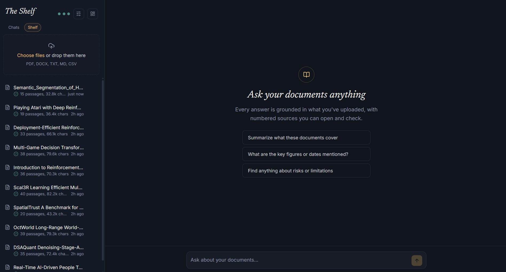

# Reading Room — RAG document Q&A

A Next.js app that lets you upload documents (PDF, DOCX, TXT, MD, CSV) and
ask questions about them in a chat interface. Every answer is grounded in
your documents and cites the exact passages it drew on — with multiple
persisted conversations, a usage dashboard, and full control over which
pipeline steps cost an API call.

Built around the RAG pipeline you provided (Supabase/pgvector + local
embeddings + Cohere rerank + LLM generation), wired into a full web app.

This project was inspired by [this youtube tutorial about RAG](https://www.youtube.com/watch?v=cYRcdsqFAmY).

## Features

### 💬 Chat — "The Conversation"


- Ask questions in plain language; answers stream in token-by-token with
  inline citations like `[1]`, `[2]` — click one (or the source chip
  under the answer) to open the **Sources panel**, which shows the exact
  passage, its source document, and a relevance bar.
- While an answer is being produced, a live stage indicator shows exactly
  where the pipeline is: reading the question → searching the shelf →
  ranking passages → writing the answer.
- **Multiple chats**, each with its own persisted history in Postgres —
  switch between them from the "Chats" tab in the sidebar. Nothing bleeds
  between chats; reload the page or come back tomorrow and they're all
  still there.
- **Pin** chats you want to keep at the top, **rename** any chat by
  double-clicking its title, **delete** with a confirmation prompt.
- **Compaction**: once a chat passes ~24 messages, everything except the
  most recent few is folded into a running summary (one extra LLM call),
  so long conversations don't keep growing the context sent to the model
  on every turn. The full transcript still displays in the UI — only the
  model's context is compacted.

### 📚 Documents — "The Shelf"



- Drag-and-drop or pick files (PDF, DOCX, TXT, MD, CSV). Each upload
  streams live progress: reading → chunking → embedding → storing.
- Status pills show processing / ready / failed per document, with a
  passage count and extracted character count once ready.
- **Rename** a document by double-clicking its name; **delete** it (and
  all its chunks, cascaded) with the trash icon.

### 📊 Dashboard — "The Ledger"


- **Database**: documents ready/total, passages (chunks) stored, total
  extracted text, and answers generated all-time.
- **API usage**, tracked per provider (OpenRouter, Cohere, local
  embeddings) with calls today / this month / all-time and tokens used —
  each shown against that provider's free-tier limits, with a pencil icon
  to edit those limits directly if a provider changes theirs.
- **Passage usage**: a searchable grid of every chunk across every
  document, with a bar showing how many times it's actually been pulled
  into an answer's context — useful for spotting documents nobody's
  questions ever touch.
- Small colored dots next to the dashboard/settings links (visible from
  the main chat screen too, not just here) give an at-a-glance usage
  status: teal = fine, amber = getting close, red = near the limit, dim =
  not configured.

### ⚙️ Settings — "The Method"

Controls exactly how much of the pipeline calls an external API, versus
running fully locally for free. See [API usage](#api-usage) below for the
full breakdown of what each option costs.

- **Query optimization** — Off / Local NLP / LLM
- **Reranking** — Cohere / Local BM25 / Off

Both save instantly when clicked — no separate save button.

## How it works

```
Upload:  file -> extract text -> chunk -> embed (local, Xenova) -> Supabase (pgvector)

Chat:    question -> optimize query -> vector search (Supabase)
                   -> rerank -> answer with citations (streamed)
```

- **Embeddings** run locally via `@xenova/transformers` (`all-MiniLM-L6-v2`,
  384 dimensions) — no API key, no per-call cost, always on.
- **Answers** are generated through [OpenRouter](https://openrouter.ai) —
  the OpenAI SDK pointed at OpenRouter's OpenAI-compatible endpoint, using
  `openrouter/free` (OpenRouter's own auto-router across free `:free`
  models) by default, so no OpenAI account is needed.
- **Query optimization and reranking are both configurable** from the
  Settings screen (see [API usage](#api-usage)).

## API usage

Every turn potentially touches up to four different services. Each has a
free local alternative except the final answer itself:

| Step                                 | Options (set in Settings)                    | Cost                                                                                                       |
| ------------------------------------ | -------------------------------------------- | ---------------------------------------------------------------------------------------------------------- |
| Embeddings (documents & every query) | always local                                 | **Free** — runs locally via Xenova, in this Node process                                                   |
| Retrieval (vector search)            | always your own Postgres                     | **Free** — your Supabase database                                                                          |
| Query optimization                   | **Off** (raw question) / **Local NLP** / LLM | Off & Local: **free**. LLM: 1 OpenRouter call                                                              |
| Reranking                            | Cohere / **Local BM25** / Off                | Local & Off: **free**. Cohere: 1 API call (auto-falls back to free local BM25 if unconfigured or it fails) |
| Answer generation                    | always OpenRouter                            | 1 API call — this is the one you keep                                                                      |
| Compaction                           | automatic, occasional                        | 1 OpenRouter call, only once every ~24 messages in a chat                                                  |

With **Query optimization: Local** and **Reranking: Local BM25** (the
defaults), a normal chat turn makes **exactly one API call** — the
OpenRouter call that writes the answer. Local query optimization
(`lib/rag/local-nlp.ts`) uses `wink-nlp`, a pure-JS library with a bundled
English model, for stopword removal and lemmatization (e.g. "running
machines" → "run machine") — no network call. Local reranking
(`lib/rag/bm25.ts`) is a from-scratch BM25 implementation, the same
lexical-ranking algorithm behind most classic search engines, scored over
those same lemmatized tokens.

The Ledger tracks every call your own app makes (logged to the `api_calls`
table) so the dashboard's numbers are exact for this app, though they
won't reflect usage from an API key shared with another project.

## Setup

### 1. Install dependencies

```bash
npm install
```

### 2. Create a Supabase project

Free tier is fine. Go to **Settings → Database → Connection string → URI**
and copy the connection string (use the "Transaction pooler" one, port
6543, for best compatibility).

### 3. Configure environment variables

```bash
cp .env.example .env.local
```

Fill in:

- `DATABASE_URL` — your Supabase Postgres connection string
- `OPENROUTER_API_KEY` — https://openrouter.ai/keys (no card required for
  free models)
- `COHERE_API_KEY` — optional, https://dashboard.cohere.com/api-keys
  (leave blank to use free local BM25 reranking instead)

### 4. Set up the database

In the Supabase SQL editor, run these five files in order:

```
db/migrations/0000_init.sql          -- pgvector, documents, chunks
db/migrations/0001_dashboard.sql     -- usage_count column, api_calls log
db/migrations/0002_chats_and_settings.sql  -- chats, chat_messages, settings
db/migrations/0003_rls.sql           -- locks tables out of Supabase's REST API
db/migrations/0004_local_nlp_settings.sql  -- query optimization / rerank mode settings
```

**Use the SQL editor, not `npm run db:push`, for this project.**
`drizzle-kit push` has two separate known incompatibilities with Supabase
that show up here: it can hang indefinitely ("Pulling schema from
database...") against the Transaction pooler connection string, since
transaction-mode pooling doesn't support the introspection queries it
needs — and separately, its introspection can crash outright
(`Cannot read properties of undefined (reading 'replace')` while parsing a
`CHECK` constraint) against Supabase-managed schemas, unrelated to
anything in this project's own tables. Neither is a sign anything is
wrong with your database — just run the SQL files above and skip
`db:push` for schema changes on this project going forward. The script is
left in `package.json` in case it works fine on a non-Supabase Postgres
instance, but it isn't the supported path here.

### 5. Run it

```bash
npm run dev
```

Open http://localhost:3000. Upload a document from the sidebar ("The
Shelf"), wait for it to say "ready", then ask a question in the chat.

> The first upload will download the local embedding model (~90MB) — this
> happens once and is cached on disk.

## Project structure

```
app/
  page.tsx                    # Main app shell (sidebar + chat)
  dashboard/page.tsx           # "The Ledger" — DB stats, API usage, passage usage grid
  settings/page.tsx            # "The Method" — query optimization & reranking modes
  api/upload/route.ts          # Streams upload/embedding progress
  api/chat/route.ts            # Streams pipeline stages + answer tokens, persists messages
  api/chats/route.ts           # List chats
  api/chats/[id]/route.ts      # Load history / rename / pin / delete a chat
  api/documents/route.ts       # List documents
  api/documents/[id]/route.ts  # Rename / delete a document
  api/dashboard/route.ts       # Aggregates stats for the dashboard
  api/usage/route.ts           # Lightweight usage snapshot for the sidebar dots
  api/settings/route.ts        # Read / update limits + query/rerank modes
lib/rag/
  embeddings.ts                # Local Xenova embeddings
  extract-text.ts              # PDF / DOCX / TXT extraction
  chunk.ts                     # Overlapping word-based chunking
  local-nlp.ts                 # Free local tokenizer: stopwords + lemmatization (wink-nlp)
  optimize-query.ts            # LLM-based query rewriting (one of 3 modes)
  bm25.ts                      # Free local BM25 reranking (one of 3 modes)
  retrieve.ts                  # pgvector cosine-similarity search
  rerank.ts                    # Dispatches to Cohere / BM25 / off, with fallback
  pipeline.ts                  # Orchestrates the above using current settings
  usage.ts                     # Logs API calls, passage usage, usage aggregation
  chats.ts                     # Chat title derivation + context loading
  compaction.ts                # Folds old messages into a running summary
  settings.ts                  # Reads/writes limits + query/rerank mode settings
db/
  schema.ts                    # Drizzle schema (documents, chunks, chats, chat_messages, api_calls, settings)
  migrations/                  # Raw SQL for the Supabase SQL editor
components/                    # UI (sidebar, chat list, chat, sources panel, etc.)
components/dashboard/          # Stat cards, editable usage meters, passage usage grid
docs/screenshots/              # Screenshots used in this README
```

## Notes

- API routes run on the Node.js runtime (not Edge) since local embeddings,
  PDF/DOCX parsing, and the Postgres client all need it.
- Supabase free projects pause after ~1 week of inactivity — resume from the
  dashboard if you see a connection error.
- Deleting a document cascades to its chunks in the database. Deleting a
  chat cascades to its messages. Renaming happens instantly (no
  confirmation); deleting asks for confirmation first.
- `openrouter/free` is a moving target — OpenRouter rotates which
  underlying free model it auto-routes to, and free models can be pulled
  from the catalog with little notice. To pin a specific model instead, set
  `OPENROUTER_MODEL` to a particular `*:free` id from
  https://openrouter.ai/models (filter "Price: Free").
- Free-tier limits shown on the dashboard (OpenRouter: 20 requests/minute
  always, 50/day until you've bought $10+ in credits then 1,000/day;
  Cohere: 1,000 calls/month, 10 rerank calls/minute) are hardcoded from
  each provider's published docs, since neither exposes a live plan/usage
  endpoint — worth double-checking against their docs if something looks
  off, as these do change. Edit them from the pencil icon on each usage
  card if so.
- A passage counts as "used" the moment it's included in the context sent
  to the LLM for an answer — regardless of whether that answer actually
  cites it inline.
- Compaction thresholds (24 messages before folding, keeping the most
  recent 8 verbatim) are constants in `lib/rag/compaction.ts` — the
  adjustable settings only cover query optimization, reranking, and API
  rate/quota limits, not this.
- **Security**: this app talks to Postgres directly via `DATABASE_URL`, not
  through Supabase's client-side API, so Supabase's Security Advisor will
  flag every table as "RLS Disabled in Public" until you run
  `0003_rls.sql`. That migration enables RLS with no policies on each
  table — it blocks all access via Supabase's auto-generated REST API
  (the thing the anon/authenticated keys talk to) without affecting the
  app's direct connection, since the default `postgres` role bypasses RLS.
  You may also see an "Extension in Public: vector" advisory — that's
  `pgvector` living in the `public` schema, which is how the migrations
  install it; moving it to a dedicated schema is possible but not done
  here, since it requires re-pointing the `vector` type in the schema and
  isn't a functional problem, just a lint preference.

