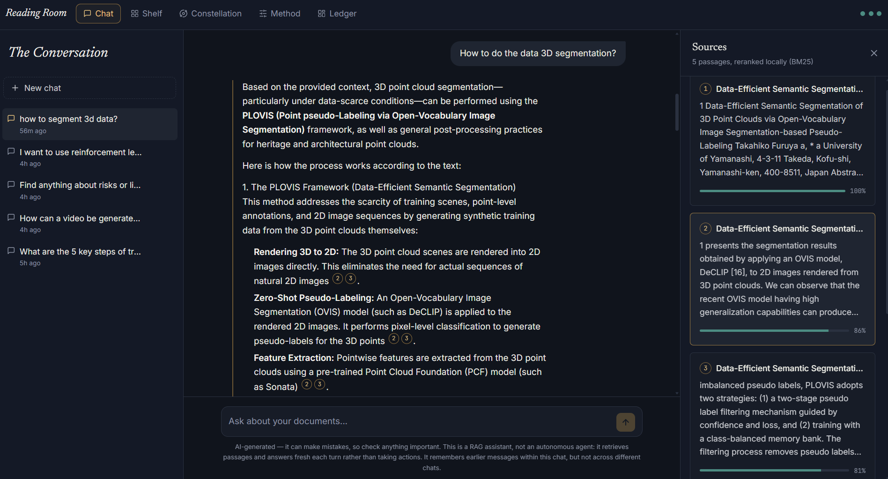
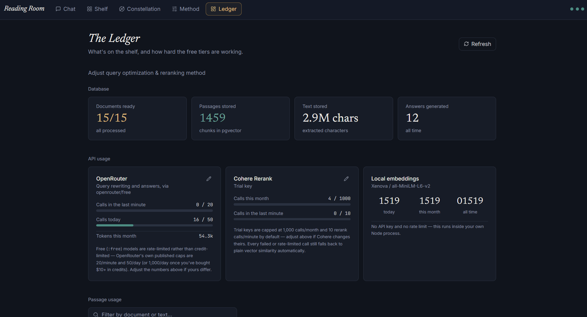

# Reading Room — RAG & Agent document Q&A

A Next.js app that lets you upload documents (PDF, DOCX, TXT, MD, CSV) and
ask questions about them in a chat interface, in either of two modes:
plain RAG (retrieve, then answer) or an Agent mode that can call tools —
document search, a calculator, and any custom API you add — in a loop
before answering. Every answer is grounded and citable, with multiple
persisted conversations, a usage dashboard, and full control over which
pipeline steps cost an API call.

Built around the RAG pipeline you provided (Supabase/pgvector + local
embeddings + Cohere rerank + LLM generation), wired into a full web app.

## Features

### Navigation

A top navbar (present on every page) links Chat, Shelf, Constellation,
Settings, and the Ledger, with the usage dots always visible on the
right. The left sidebar only shows on the Chat page and is reserved
entirely for switching between conversations.

### 💬 Chat — "The Conversation"



- Ask questions in plain language; answers stream in token-by-token with
  inline citations like `[1]`, `[2]` — click one (or the source chip
  under the answer) to open the **Sources panel**, which shows the exact
  passage, its source document, and a relevance bar.
- **Math, chemistry, and nuclear notation render properly** (via
  `remark-math` + `rehype-katex`/KaTeX) instead of showing raw LaTeX
  source — a model output like `\(^{4}_{3}\mathrm{Li}\)` renders as an
  actual isotope symbol, not a string full of stray backslashes and
  braces. The system prompt asks the model for `$...$`/`$$...$$`
  delimiters, and `\(...\)`/`\[...\]` are normalized to that automatically
  as a fallback, since plain CommonMark otherwise mangles raw LaTeX badly
  (it silently strips backslashes before punctuation, and underscore
  subscripts collide with markdown's emphasis syntax).
- **Tables, strikethrough, and task lists render properly** too (via
  `remark-gfm`) — plain CommonMark (what's left without it) doesn't
  support pipe-table syntax at all, so a markdown table would otherwise
  render as one long run-on paragraph with literal `|` characters, since
  HTML collapses the newlines between rows inside a plain `<p>`. Wide
  tables scroll horizontally instead of squeezing columns unreadably on
  narrow chat widths.
- While an answer is being produced, a live stage indicator shows exactly
  where the pipeline is: reading the question → searching the shelf →
  ranking passages → writing the answer.
- **Multiple chats**, each with its own persisted history in Postgres —
  switch between them from the "Chats" tab in the sidebar. Nothing bleeds
  between chats; reload the page or come back tomorrow and they're all
  still there.
- **Pin** chats you want to keep at the top, **rename** any chat by
  double-clicking its title, **delete** with a confirmation prompt.
- **Compaction**: once a chat passes ~24 messages, everything except the
  most recent few is folded into a running summary (one extra LLM call),
  so long conversations don't keep growing the context sent to the model
  on every turn. The full transcript still displays in the UI — only the
  model's context is compacted.

### 📚 Documents — "The Shelf"

Its own full page now (not a sidebar tab), with documents shown as tiles
in a responsive grid rather than a list:

- Drag-and-drop or pick files (PDF, DOCX, TXT, MD, CSV) from the upload
  zone at the top. Each upload streams live progress: reading → chunking
  → embedding → storing.
- Each tile shows a status badge (processing / ready / failed), passage
  count and extracted character count once ready, file type, and upload
  time.
- **Filter** by name (search box), status, or file type (type filters
  only appear once more than one type is present); **sort** by newest,
  oldest, name, most passages, or most text.
- **Rename** a document by double-clicking its name on the tile;
  **delete** it (and all its chunks, cascaded) with the trash icon.

### 📊 Dashboard — "The Ledger"



- **Database**: documents ready/total, passages (chunks) stored, total
  extracted text, and answers generated all-time.
- **API usage**, tracked per provider (OpenRouter, Cohere, local
  embeddings) with calls today / this month / all-time and tokens used —
  each shown against that provider's free-tier limits, with a pencil icon
  to edit those limits directly if a provider changes theirs.
- **Passage usage**: a searchable grid of every chunk across every
  document, with a bar showing how many times it's actually been pulled
  into an answer's context — useful for spotting documents nobody's
  questions ever touch.
- Small colored dots in the top navbar (visible from every page, not just
  here) give an at-a-glance usage status: teal = fine, amber = getting
  close, red = near the limit, dim = not configured.

### 🌌 Embedding space — "The Constellation"

Enter any word or phrase and see it mapped in 3D alongside the passages
closest to it in embedding space, plus a handful of unrelated passages
shown for scale/contrast. Lines connect the query to its nearest
neighbors; hover or click a point for its excerpt and similarity score.
Built with `three.js` / `@react-three/fiber`, with the 384-dimension
embeddings projected down to 3D via UMAP (falls back to a simple radial
layout if there are too few passages for UMAP's neighbor graph to be
meaningful, e.g. right after your first upload).

- **Color per document**: each document gets a maximally-distinct hue via
  golden-angle stepping (the same spacing trick used for evenly splitting
  a circle, e.g. sunflower seed heads) rather than a small fixed palette —
  every document reads as clearly different even with a dozen-plus of
  them, and every chunk of the same document always shares its color.
  Colors are assigned in upload order and fetched once, so a document
  keeps the same color across different searches.
- **Results panel**: a collapsible overlay (top-right, click to expand or
  collapse) lists every plotted passage sorted by similarity, with its
  document's color dot and a percentage. Clicking a row pins that point's
  tooltip open in the 3D view — and vice versa, clicking a point in the
  scene highlights it in the list.

This is a genuine map, not a canned animation: click a passage in the
Sources panel after a chat answer, and note its similarity score — the
same relationship is what positions it here.

### ⚙️ Settings — "The Method"

Controls exactly how much of the pipeline calls an external API, versus
running fully locally for free. See [API usage](#api-usage) below for the
full breakdown of what each option costs.

- **Query optimization** — Off / Local NLP / LLM
- **Reranking** — Cohere / Local BM25 / Off

Both save instantly when clicked — no separate save button.

### 🤖 Agent mode

A toggle in the top navbar (RAG / Agent) switches how the *next* message
in any chat gets answered. Nothing is locked per chat — mode is tracked
**per message**, not per chat, so a single conversation can freely mix
RAG turns and Agent turns; each assistant message shows a small badge
saying which one produced it.

- **RAG mode** (default): the fixed retrieve-then-answer pipeline described
  above.
- **Agent mode**: the model can call tools — possibly several times, in a
  loop — before producing a final answer, instead of always retrieving
  automatically. Built-in tools:
  - `search_documents` — the same retrieval + rerank pipeline as RAG mode,
    but now something the model *chooses* to call (and can call again with
    a refined query if the first search wasn't enough).
  - `list_documents` — what's uploaded and its status, so the model can
    check before searching.
  - `calculator` — arithmetic via a restricted expression parser
    ([`expr-eval`](https://www.npmjs.com/package/expr-eval)), not `eval()`.
  - `current_datetime` — optionally in a specific IANA timezone.
  - `remember`, `list_memories`, `forget` — persistent memory (see below).
  - `web_search` — free and open-source web search via
    [SearXNG](https://docs.searxng.org/), a self-hosted or public
    metasearch instance, not a paid search API. Only offered to the model
    at all once a SearXNG URL is configured in Settings → "Agent mode" →
    "Web search" (a live "Test" button checks it works before you rely on
    it). Worth knowing before you configure one: SearXNG's JSON output is
    **off by default**, even on most public instances — they deliberately
    disable it to deter scraping — so the reliable path is self-hosting
    (`docker run -p 8080:8080 searxng/searxng`, then add `json` to
    `search.formats` in its `settings.yml`). Web search results aren't fed
    into the same `[1]`/`[2]` citation system as document sources (that
    system is specifically tied to document chunks); they show up in the
    "Thinking" panel and the model can link to them directly in its answer.
  - **Custom tools**, added from the "Agent mode" section of Settings:
    name, description, HTTP method, a URL template with `{param}`
    placeholders, and a parameter list. Deliberately HTTP-calling rather
    than arbitrary code — "add a tool" means "call an API", not "run
    generated code on the server". Requests are guarded against hitting
    private/internal network addresses (loopback, `10.x`, `172.16-31.x`,
    `192.168.x`, link-local/cloud-metadata ranges) — worth having even in
    a single-user self-hosted app, since a tool call is initiated by the
    *model*, and content it retrieves from a document could in principle
    try to prompt-inject it into calling a tool somewhere it shouldn't.
  - A **max tool calls per turn** limit (Settings, default 6) caps the
    total number of tool calls in a single turn — enforced per call, not
    per LLM round-trip, since a single response can legally request
    several tool calls at once and an iteration-based cap wouldn't catch
    that. Exact-repeat calls (same tool, same arguments) are served from a
    per-turn cache instead of re-running the pipeline. If the cap is hit
    mid-batch, every outstanding tool call still gets answered (even if
    that answer is just "skipped"), then one final call is made with no
    tools offered, forcing a real answer instead of leaving you with
    nothing.
- **Thinking is recorded, not just streamed**: every tool call and its
  result appears live as it happens (a collapsible "Thinking" panel on the
  message), and the full sequence is saved with the message — reopening
  the chat later shows exactly the same steps, not just the final text.
- **Citations get a real Sources panel, same as RAG mode.** Every
  `search_documents` call across a turn feeds into one shared registry
  that gives each unique passage a stable citation number — the same
  passage always gets the same number even if a later search in the same
  turn returns it again, and numbering stays consistent across multiple
  searches rather than each call restarting at `[1]`. The final answer's
  `[1]`, `[2]` badges are clickable and the source-chip row + Sources
  panel appear under the message exactly like a RAG answer, because
  they're the same `sources` field and the same UI — Agent mode just
  populates it from tool calls instead of one fixed retrieval step.
- **Tool usage is tracked** the same way API usage already is, visible on
  the Ledger.
- **Persistent memory, global across chats — not tied to any one
  conversation.** When you ask the agent to remember something, or state a
  standing preference or instruction ("always...", "never...", a fact
  about yourself worth keeping), it calls the `remember` tool to actually
  save it, rather than just claiming it will. The full current memory list
  is included in the system prompt on *every* Agent-mode turn (so the
  model always has it without needing to explicitly look it up), and
  `forget` deletes an entry by id when it's asked to or something's gone
  stale. This is deliberately separate from a chat's own history/summary —
  it's meant to persist the way a standing instruction should, independent
  of which conversation it was given in. Manage it directly (view, add,
  delete) from Settings → "Memory", not just through the agent.
- **Every message shows exactly how many LLM calls it took** — RAG or
  Agent, no exceptions. A small "N LLM call(s)" label sits next to the
  RAG/Agent badge on every assistant message, persisted with it so it's
  still there when you reopen the chat later. In RAG mode this is 1 (or 2
  if query optimization is set to LLM), computed deterministically from
  settings; in Agent mode it's a live count of every round-trip the tool
  loop actually made.
- **Cost tradeoff, stated plainly**: Agent mode uses *more* API calls per
  turn than RAG mode, not fewer — each tool round trip is a real call to
  OpenRouter. This is the opposite direction from minimizing calls; it's a
  genuine tradeoff for the added capability, not a free upgrade.
- **Built on the Vercel AI SDK** (`ai` + `@openrouter/ai-sdk-provider`)
  rather than a hand-rolled loop against the raw chat-completions
  endpoint — the SDK owns the "call model → run tools → feed results back
  → call model again" mechanics; this app's own logic (citation
  numbering across searches, the per-tool-call step budget, exact-repeat
  caching, live step events, tool-call logging, memory injection) lives
  entirely inside each tool's own `execute()`, unchanged in behavior from
  before, just now running under the SDK's orchestration instead of a
  manual `while` loop. This was a deliberate choice over
  [Mastra](https://mastra.ai): Mastra has grown into a full agent
  platform (workflows, goals, sub-agent delegation, its own memory/storage
  system) — 71MB for `@mastra/core` alone versus 8.5MB for `ai` — and
  adopting it would have meant either fighting its opinions about storage
  or using ~2% of its surface for what the AI SDK already does directly.
- **Model compatibility matters here**: `openrouter/free` (the default) is
  an auto-router across many free models, and not all of them support
  OpenAI-style tool calling — if Agent mode's tool calls seem to silently
  not happen, this is almost always why. The app checks this for you: if
  the configured model is the auto-router, or is a specific model that
  doesn't advertise tool support (checked live against OpenRouter's public
  `/models` endpoint, cached for an hour), a dismissible banner appears in
  Agent mode pointing you at Settings to pick a tool-capable one.
- **The model itself is a Settings-page setting, not just an env var.**
  Settings → "The Method" → Model shows every current free OpenRouter
  model with a green "Tools" badge on the ones that support function
  calling, searchable, plus a manual text field if you'd rather pin any
  model id directly (including a paid one). This one setting controls
  every OpenRouter call the app makes — query rewriting, RAG answers,
  Agent mode, and compaction — there's no separate model per feature.
  `OPENROUTER_MODEL` in `.env.local` still exists, but only seeds the
  first-ever value; after that, changing it there does nothing until you
  change it in Settings, which is the one source of truth from then on.

## How it works

```
Upload:  file -> extract text -> chunk -> embed (local, Xenova) -> Supabase (pgvector)

Chat:    question -> optimize query -> vector search (Supabase)
                   -> rerank -> answer with citations (streamed)
```

- **Embeddings** run locally via `@xenova/transformers` (`all-MiniLM-L6-v2`,
  384 dimensions) — no API key, no per-call cost, always on.
- **Answers** are generated through [OpenRouter](https://openrouter.ai) —
  the OpenAI SDK pointed at OpenRouter's OpenAI-compatible endpoint, using
  `openrouter/free` (OpenRouter's own auto-router across free `:free`
  models) by default, so no OpenAI account is needed.
- **Query optimization and reranking are both configurable** from the
  Settings screen (see [API usage](#api-usage)).

## API usage

This table describes **RAG mode**. Every turn potentially touches up to
four different services, each with a free local alternative except the
final answer itself:

| Step | Options (set in Settings) | Cost |
|---|---|---|
| Embeddings (documents & every query) | always local | **Free** — runs locally via Xenova, in this Node process |
| Retrieval (vector search) | always your own Postgres | **Free** — your Supabase database |
| Query optimization | **Off** (raw question) / **Local NLP** / LLM | Off & Local: **free**. LLM: 1 OpenRouter call |
| Reranking | Cohere / **Local BM25** / Off | Local & Off: **free**. Cohere: 1 API call (auto-falls back to free local BM25 if unconfigured or it fails) |
| Answer generation | always OpenRouter | 1 API call — this is the one you keep |
| Compaction | automatic, occasional | 1 OpenRouter call, only once every ~24 messages in a chat |

With **Query optimization: Local** and **Reranking: Local BM25** (the
defaults), a normal RAG-mode chat turn makes **exactly one API call** —
the OpenRouter call that writes the answer. Local query optimization
(`lib/rag/local-nlp.ts`) uses `wink-nlp`, a pure-JS library with a bundled
English model, for stopword removal and lemmatization (e.g. "running
machines" → "run machine") — no network call. Local reranking
(`lib/rag/bm25.ts`) is a from-scratch BM25 implementation, the same
lexical-ranking algorithm behind most classic search engines, scored over
those same lemmatized tokens.

**Agent mode is different**: every LLM round-trip in the tool-calling loop
is its own OpenRouter call (logged separately from the final answer,
purpose `agent_step` vs `chat_completion`, so the Ledger's "Answers
generated" stat isn't inflated by intermediate steps) — but a single
round-trip can carry several tool calls at once, so the call count doesn't
scale 1:1 with tool calls the way it does with rounds. A turn that ends up
making 4 tool calls, all requested in one round-trip, is 2 OpenRouter
calls (that round-trip plus the final answer); the same 4 tool calls
spread one-per-round-trip would be 5. Either way, the total number of tool
calls itself is capped by the "max tool calls per turn" setting.

The Ledger tracks every call your own app makes (logged to the `api_calls`
table) so the dashboard's numbers are exact for this app, though they
won't reflect usage from an API key shared with another project.

## Setup

### 1. Install dependencies

```bash
npm install
```

### 2. Create a Supabase project

Free tier is fine. Go to **Settings → Database → Connection string → URI**
and copy the connection string (use the "Transaction pooler" one, port
6543, for best compatibility).

### 3. Configure environment variables

```bash
cp .env.example .env.local
```

Fill in:

- `DATABASE_URL` — your Supabase Postgres connection string
- `OPENROUTER_API_KEY` — https://openrouter.ai/keys (no card required for
  free models)
- `COHERE_API_KEY` — optional, https://dashboard.cohere.com/api-keys
  (leave blank to use free local BM25 reranking instead)

### 4. Set up the database

In the Supabase SQL editor, run these nine files in order:

```
db/migrations/0000_init.sql          -- pgvector, documents, chunks
db/migrations/0001_dashboard.sql     -- usage_count column, api_calls log
db/migrations/0002_chats_and_settings.sql  -- chats, chat_messages, settings
db/migrations/0003_rls.sql           -- locks tables out of Supabase's REST API
db/migrations/0004_local_nlp_settings.sql  -- query optimization / rerank mode settings
db/migrations/0005_agent_mode.sql    -- agent mode, custom tools, tool call log
db/migrations/0006_openrouter_model_setting.sql -- moves the model into a live setting
db/migrations/0007_agent_memory.sql  -- persistent, cross-chat agent memory
db/migrations/0008_web_search_and_call_counts.sql -- web search setting, per-message LLM call counts
```

**Use the SQL editor, not `npm run db:push`, for this project.**
`drizzle-kit push` has two separate known incompatibilities with Supabase
that show up here: it can hang indefinitely ("Pulling schema from
database...") against the Transaction pooler connection string, since
transaction-mode pooling doesn't support the introspection queries it
needs — and separately, its introspection can crash outright
(`Cannot read properties of undefined (reading 'replace')` while parsing a
`CHECK` constraint) against Supabase-managed schemas, unrelated to
anything in this project's own tables. Neither is a sign anything is
wrong with your database — just run the SQL files above and skip
`db:push` for schema changes on this project going forward. The script is
left in `package.json` in case it works fine on a non-Supabase Postgres
instance, but it isn't the supported path here.

### 5. Run it

```bash
npm run dev
```

Open http://localhost:3000. Upload a document from "The Shelf" (top
navbar), wait for it to say "ready", then ask a question in the chat.

> The first upload will download the local embedding model (~90MB) — this
> happens once and is cached on disk.

## Project structure

```
app/
  page.tsx                    # Main app shell (sidebar + chat)
  dashboard/page.tsx           # "The Ledger" — DB stats, API usage, passage/tool usage grids
  settings/page.tsx            # "The Method" — query/rerank modes + Agent mode + tools
  constellation/page.tsx       # "The Constellation" — 3D embedding-space map
  shelf/page.tsx                # "The Shelf" — filterable/sortable document tile grid
  api/upload/route.ts          # Streams upload/embedding progress
  api/chat/route.ts            # Streams pipeline stages + answer tokens; branches RAG/Agent
  api/chats/route.ts           # List chats
  api/chats/[id]/route.ts      # Load history / rename / pin / delete a chat
  api/documents/route.ts       # List documents
  api/documents/[id]/route.ts  # Rename / delete a document
  api/dashboard/route.ts       # Aggregates stats for the dashboard
  api/usage/route.ts           # Lightweight usage snapshot for the navbar dots
  api/settings/route.ts        # Read / update limits + query/rerank modes + agent max steps
  api/embedding-space/route.ts # Embeds a phrase, finds neighbors, projects to 3D
  api/agent-tools/route.ts     # List built-in + custom tools; create a custom tool
  api/agent-tools/[id]/route.ts # Enable/disable, edit, or delete a custom tool
  api/agent-model-check/route.ts # Checks the configured model's tool-calling support
  api/openrouter-models/route.ts # Lists free OpenRouter models, flagged by tool support
  api/agent-memory/route.ts    # List / add a persistent memory entry
  api/agent-memory/[id]/route.ts # Delete a memory entry
  api/web-search-check/route.ts # Live-tests a SearXNG URL from Settings
lib/rag/
  embeddings.ts                # Local Xenova embeddings
  extract-text.ts              # PDF / DOCX / TXT extraction
  chunk.ts                     # Overlapping word-based chunking
  local-nlp.ts                 # Free local tokenizer: stopwords + lemmatization (wink-nlp)
  optimize-query.ts            # LLM-based query rewriting (one of 3 modes)
  bm25.ts                      # Free local BM25 reranking (one of 3 modes)
  retrieve.ts                  # pgvector cosine-similarity search
  rerank.ts                    # Dispatches to Cohere / BM25 / off, with fallback
  pipeline.ts                  # Orchestrates the above using current settings
  usage.ts                     # Logs API calls, passage usage, usage aggregation
  chats.ts                     # Chat title derivation + context loading
  compaction.ts                # Folds old messages into a running summary
  settings.ts                  # Reads/writes limits + query/rerank/agent settings
  embedding-space.ts           # Nearest-neighbor search + UMAP projection to 3D
lib/agent/
  tools.ts                     # Built-in tools: search_documents, list_documents, calculator, current_datetime, web_search, remember, list_memories, forget
  custom-tools.ts               # Loads custom tools from DB, executes them over HTTP
  ssrf-guard.ts                  # Blocks custom tool calls to private/internal addresses
  loop.ts                        # Agent orchestration on the Vercel AI SDK, with step recording
  model-check.ts                 # Checks the configured model's tool support + lists free models
  tool-usage.ts                   # Aggregates tool_call_log for the dashboard
  memory.ts                       # CRUD for persistent, cross-chat agent memory
lib/
  constellation-colors.ts      # Golden-angle per-document color assignment
  markdown.ts                  # Normalizes \( \) / \[ \] LaTeX delimiters to $ / $$
db/
  schema.ts                    # Drizzle schema (documents, chunks, chats, chat_messages, agent_tools, agent_memories, tool_call_log, api_calls, settings)
  migrations/                  # Raw SQL for the Supabase SQL editor
components/                    # UI (top navbar, sidebar, chat list, chat, sources panel, etc.)
components/dashboard/          # Stat cards, editable usage meters, passage/tool usage grids
components/constellation/      # The three.js/@react-three/fiber 3D scene + collapsible results list
components/shelf/              # Document tile grid
components/settings/           # Model picker, web search settings, agent tools manager, memory manager
docs/screenshots/              # Screenshots used in this README
```

Agent-mode-specific frontend pieces (not tied to one folder above):
`ModeProvider.tsx` / `ModeToggle.tsx` (RAG/Agent switch, in the navbar),
`AgentSteps.tsx` (the live + persisted "Thinking" panel on a message),
`AgentModelWarning.tsx` (the dismissible tool-support warning banner).

## Notes

- **The Agent-mode tool-calling loop hasn't been behaviorally tested
  against a live model.** Its logic (source registry, dedup cache,
  per-tool-call budget, memory injection) was verified piece by piece and
  the AI SDK's `tool()`/`jsonSchema()` construction was runtime-tested
  directly, but there was no `OPENROUTER_API_KEY` or network access to
  openrouter.ai available while building this, so a real end-to-end
  tool-calling round trip has never actually run. Test one real Agent-mode
  conversation after pulling this before trusting it.
- API routes run on the Node.js runtime (not Edge) since local embeddings,
  PDF/DOCX parsing, and the Postgres client all need it.
- Supabase free projects pause after ~1 week of inactivity — resume from the
  dashboard if you see a connection error.
- **Mode is tracked per message, not per chat.** A chat's `mode` isn't a
  fixed property — every message row (`chat_messages.mode`) records which
  pipeline produced or received it, so switching RAG/Agent mid-conversation
  is always allowed and each turn is honestly labeled, rather than forcing
  a chat to pick one mode at creation time.
- **Agent mode won't always search your documents, even when relevant.**
  Unlike RAG mode (which always retrieves), the model decides whether a
  question needs `search_documents` — the system prompt nudges it to check
  proactively, but a question it can answer from general training
  knowledge may not trigger a search even if your documents also cover it.
  If you want retrieval to happen every time, RAG mode does that
  unconditionally; Agent mode trades that guarantee for the ability to act
  on the answer.
- **Redundant tool calls are only caught when they're exact repeats**
  (same tool, same arguments, case/whitespace-insensitive — served from a
  per-turn cache instead of re-running the pipeline). A model that issues
  several genuinely-differently-worded searches for the same underlying
  question isn't deduplicated — that's mitigated by the system prompt
  asking for one well-chosen query per concept, not prevented outright.
  Free/weaker models (especially via the `openrouter/free` auto-router)
  tend to do this more; pinning a stronger tool-calling model in Settings
  usually reduces it.
- **Custom agent tools call HTTP endpoints, not code.** There's no way to
  give the agent a tool that runs arbitrary server-side logic — "add a
  tool" always means "call a URL with these parameters". This is a
  deliberate ceiling on what "create more tools" can mean here, in
  exchange for not needing to sandbox arbitrary code execution.
- The SSRF guard on custom tools (`lib/agent/ssrf-guard.ts`) blocks
  loopback, private (`10.x`, `172.16-31.x`, `192.168.x`), and link-local/
  cloud-metadata address ranges, resolving hostnames via DNS first so a
  domain that merely *points at* a private IP is caught too — but it can't
  stop a custom tool from calling a public API that itself does something
  undesirable with the data it's sent. Treat custom tools as extending
  trust to whatever they call.
- Deleting a document cascades to its chunks in the database. Deleting a
  chat cascades to its messages. Renaming happens instantly (no
  confirmation); deleting asks for confirmation first.
- `openrouter/free` is a moving target — OpenRouter rotates which
  underlying free model it auto-routes to, and free models can be pulled
  from the catalog with little notice. To pin a specific model instead,
  use the model picker in Settings — it lists what's currently free and
  flags which ones support tool calling, so you're not guessing.
- Free-tier limits shown on the dashboard (OpenRouter: 20 requests/minute
  always, 50/day until you've bought $10+ in credits then 1,000/day;
  Cohere: 1,000 calls/month, 10 rerank calls/minute) are hardcoded from
  each provider's published docs, since neither exposes a live plan/usage
  endpoint — worth double-checking against their docs if something looks
  off, as these do change. Edit them from the pencil icon on each usage
  card if so.
- A passage counts as "used" the moment it's included in the context sent
  to the LLM for an answer — regardless of whether that answer actually
  cites it inline.
- The Constellation's 3D layout is recomputed fresh on every search — UMAP's
  optimization has some randomness in its initialization, so re-mapping the
  exact same phrase can shift the precise coordinates slightly between
  runs. The relationships (what's near what) stay consistent; only the
  camera-relative positions and rotation wander.
- Compaction thresholds (24 messages before folding, keeping the most
  recent 8 verbatim) are constants in `lib/rag/compaction.ts` — the
  adjustable settings only cover query optimization, reranking, and API
  rate/quota limits, not this.
- **Security**: this app talks to Postgres directly via `DATABASE_URL`, not
  through Supabase's client-side API, so Supabase's Security Advisor will
  flag every table as "RLS Disabled in Public" until you run
  `0003_rls.sql`. That migration enables RLS with no policies on each
  table — it blocks all access via Supabase's auto-generated REST API
  (the thing the anon/authenticated keys talk to) without affecting the
  app's direct connection, since the default `postgres` role bypasses RLS.
  You may also see an "Extension in Public: vector" advisory — that's
  `pgvector` living in the `public` schema, which is how the migrations
  install it; moving it to a dedicated schema is possible but not done
  here, since it requires re-pointing the `vector` type in the schema and
  isn't a functional problem, just a lint preference.
