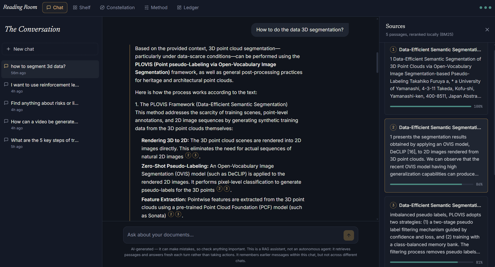
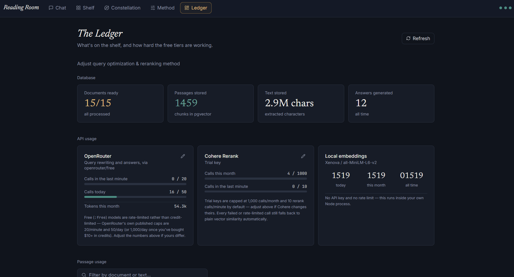

# Reading Room — RAG & Agent document Q&A

A Next.js app that lets you upload documents (PDF, DOCX, TXT, MD, CSV) and
ask questions about them in a chat interface, in either of two modes: plain
RAG (retrieve, then answer) or an Agent mode that can call tools — document
search, web search, a calculator, persistent memory, and any custom API you
add — in a loop before answering. Every answer is grounded and citable,
every LLM call and every stage of producing it is timed and recorded, and
you have full control over which pipeline steps cost an API call and which
model runs them.

Built around the RAG pipeline you provided (Supabase/pgvector + local
embeddings + Cohere rerank + LLM generation), grown into a full web app.

## Features

### Navigation

A top navbar (present on every page) links Chat, Shelf, Constellation,
Settings, and the Ledger, with a RAG/Agent mode toggle and the usage rings
always visible on the right. The left sidebar only shows on the Chat page
and is reserved entirely for switching between conversations.

### 💬 Chat — "The Conversation"



- Ask questions in plain language; answers stream in token-by-token with
  inline citations like `[1]`, `[2]` — click one (or the source chip under
  the answer) to open the **Sources panel**, which shows the exact passage,
  its source document, its page (for PDFs), and a relevance bar. Citations
  from the same document collapse into one chip with all its numbers as
  small badges inside, rather than repeating the document name once per
  passage (hover a badge to see its page).
- **Stop generating, with a real cancellation, not a cosmetic one.** The
  send button turns into a stop button the moment a request starts. The
  same abort signal that stops the browser from waiting for more of the
  response is threaded server-side into every OpenRouter/Cohere call the
  turn was making (RAG's answer generation, its optional query-rewrite
  call, and every round of Agent mode's tool-calling loop) — stopping
  actually cancels the in-flight call and stops paying for tokens, not
  just stops the UI from displaying them. Whatever text or tool calls
  happened before the stop are kept, not thrown away — the message is
  still saved, same as a normal answer, just shorter.
- **Copy any message** with the hover button that appears over it — user
  and assistant messages both.
- **Dictate your prompt** with the mic button next to Send — speech-to-text
  runs fully offline in the browser (Whisper, via a Web Worker), audio
  never leaves your machine, and the input fills in as you talk rather
  than only once you stop. **Listen to any answer** with the speaker
  button that appears on hover — text-to-speech via the browser's own
  built-in voices, also fully local. Both the Whisper model and the
  playback voice/speed/pitch are personalizable from Settings → Voice.
  See [Voice input & output](#voice-input--output) below for how each one
  actually works and why they're built differently from each other.
- **Edit and resend your last message — nothing is ever deleted.** Only
  the most recent message you sent gets an Edit control (hover to reveal
  it, alongside Copy). Saving an edit doesn't replace anything in the
  database: it deactivates the old user message and its reply and inserts
  a new pair sharing an edit group with them, then resends the edited
  text through the normal flow. The old pair stays saved and reachable —
  the edited message shows a small "Edited · 2/3" indicator with ◀ ▶
  arrows to browse every previous version and its paired answer. There's
  no messageId involved in targeting which message to edit — it always
  acts on whichever message is currently last, which is also what makes
  it work for a message you just sent in this session (its real database
  id isn't known client-side until the chat is reloaded).
- **Limit a question to specific documents** with the "Search in" picker
  above the input (shown once you have two or more documents). It applies
  to both RAG and Agent mode until you change it.
- **Every answer shows how long it took and how many LLM calls that took.**
  A small badge row under each assistant message reads e.g. "Agent",
  "3 LLM calls", "2.4s" as separate elements — deliberately just the
  total, not a full per-stage breakdown (that level of detail lives on the
  Ledger's [Timing](#timing) charts instead). Persisted with the message,
  so reopening a chat later shows the same numbers, not just at send time.
- **Math, chemistry, and nuclear notation render properly** (via
  `remark-math` + `rehype-katex`/KaTeX) instead of showing raw LaTeX source
  — a model output like `\(^{4}_{3}\mathrm{Li}\)` renders as an actual
  isotope symbol, not a string full of stray backslashes and braces. The
  system prompt asks the model for `$...$`/`$$...$$` delimiters, and
  `\(...\)`/`\[...\]` are normalized to that automatically as a fallback,
  since plain CommonMark otherwise mangles raw LaTeX badly (it silently
  strips backslashes before punctuation, and underscore subscripts collide
  with markdown's emphasis syntax).
- **Tables, strikethrough, and task lists render properly** too (via
  `remark-gfm`) — plain CommonMark (what's left without it) doesn't support
  pipe-table syntax at all, so a markdown table would otherwise render as
  one long run-on paragraph with literal `|` characters, since HTML
  collapses the newlines between rows inside a plain `<p>`. Wide tables
  scroll horizontally instead of squeezing columns unreadably on narrow
  chat widths.
- While an answer is being produced, a live stage indicator shows exactly
  where the pipeline is: reading the question → searching the shelf →
  ranking passages → writing the answer (RAG), or a live "Thinking" panel
  of tool calls as they happen (Agent).
- **Multiple chats**, each with its own persisted history in Postgres —
  switch between them from the "Chats" tab in the sidebar. Nothing bleeds
  between chats; reload the page or come back tomorrow and they're all
  still there.
- **Pin** chats you want to keep at the top, **rename** any chat by
  double-clicking its title, **delete** with a confirmation prompt.
- **Compaction**: once a chat passes ~24 messages, everything except the
  most recent few is folded into a running summary (one extra LLM call), so
  long conversations don't keep growing the context sent to the model on
  every turn. The full transcript still displays in the UI — only the
  model's context is compacted.

### 📚 Documents — "The Shelf"

Its own full page (not a sidebar tab), with documents shown as tiles in a
responsive grid rather than a list:

- Drag-and-drop or pick files (PDF, DOCX, TXT, MD, CSV) from the upload
  zone at the top. **Indexing runs in the background**: the upload only
  reads the file (seconds), then a background worker OCRs, chunks and
  embeds it. Each tile shows what's happening ("Reading scanned pages
  3/10", "Indexing passages 40/120") with a progress bar, and the work
  carries on if you close the tab. A document that fails gets a Retry
  button. See [Background processing](#background-processing).
- **PDFs keep their page numbers.** Each passage records the page(s) it
  came from, shown on the source chips and in the Sources panel ("p. 4",
  "pp. 4–5") and given to the model alongside the excerpt. Words hyphenated
  across a line break are rejoined. PDFs uploaded before page tracking
  existed show no page until re-uploaded.
- **Scanned PDFs are OCR'd, offline.** Pages without a text layer (scans,
  photographed pages) are rendered and read with tesseract.js, using
  language data installed from npm, so no image ever leaves the machine.
  Only pages that need it are OCR'd, so a mostly-digital PDF with a few
  scanned pages costs only those pages (about 1-3 s each). Languages are
  set with `OCR_LANGUAGES` (default `eng+ita`); add one with
  `npm install @tesseract.js-data/<code>` (e.g. `fra`, `deu`, `spa`).
- **Any language.** Each document's language is detected when it's
  indexed and shown on its tile, and keyword search stems it in that
  language. The default embedding model is multilingual, so a question in
  one language finds passages in another. See [Languages](#languages).
- Each tile shows a status badge (queued / processing / ready / failed), passage
  count and extracted character count once ready, file type, and upload
  time.
- **Filter** by name (search box), status, or file type (type filters only
  appear once more than one type is present); **sort** by newest, oldest,
  name, most passages, or most text.
- **Rename** a document by double-clicking its name on the tile; **delete**
  it (and all its chunks, cascaded) with the trash icon.
- **"Group similar"** clusters documents by how alike their content
  actually is, not by any fixed category list — there's no taxonomy to
  classify into, only which documents read as similar to which others. Each
  document gets a centroid embedding (the elementwise mean of its chunks'
  embeddings, computed once when it finishes processing); pairwise
  similarity between every pair of centroids is computed in SQL with
  pgvector's cosine distance operator, then documents are grouped via
  union-find using an **adaptive threshold** — pairs more than one
  standard deviation above this particular document set's own mean
  similarity, not a fixed cosine number. A fixed threshold has an
  all-or-nothing failure mode: centroid-averaging dilutes topic signal
  across every chunk in a document, which compresses the whole similarity
  range down, sometimes low enough that even genuinely related documents
  never cross a fixed bar — so *everything* lands in "not similar to
  others" instead of a sensible split. The adaptive version finds the
  documents that stand out *relative to this batch*, whatever the absolute
  numbers happen to be for a given embedding model and document mix. Group
  labels are generated locally too — the top significant terms (via the
  same `wink-nlp` tokenizer/lemmatizer already used for local reranking)
  across a sample of each group's content, not an LLM call — so grouping
  costs nothing beyond embeddings you'd already have. Documents not
  similar enough to anything else land in a "Not similar to others"
  section rather than being forced
  into a group.

### 📊 Dashboard — "The Ledger"



- **Database**: documents ready/total, passages (chunks) stored, total
  extracted text, and answers generated all-time.
- **API usage**, tracked per provider (OpenRouter, Cohere, local
  embeddings) with calls today / this month / all-time and tokens used —
  each shown against that provider's free-tier limits, with a pencil icon
  to edit those limits directly if a provider changes theirs.
- **Passage usage**: a searchable grid of every chunk across every
  document, with a bar showing how many times it's actually been pulled
  into an answer's context — useful for spotting documents nobody's
  questions ever touch.
- **Tool usage** (Agent mode): calls, success rate, and last-used time per
  tool, built-in or custom.
- **Timing**, with real charts: average total turn time up top, a 14-day
  daily-average trend line, and a bar breakdown of every measured stage —
  query optimization, retrieval, reranking, answer generation for RAG mode;
  each LLM round-trip and each individual tool call (`tool:search_documents`,
  `tool:web_search`, etc.) for Agent mode — with average/min/max duration
  and call count for each. Every one of those is a real, persisted
  measurement, not an estimate (see [Timing](#timing) below).
- Small progress rings in the top navbar (visible from every page, not
  just here) give an at-a-glance usage status per provider: teal = fine,
  brass = getting close, rust = near the limit, dim = not configured — the
  ring itself fills proportionally, not just a static color.

### 🌌 Embedding space — "The Constellation"

Enter any word or phrase and see it mapped in 3D alongside the passages
closest to it in embedding space, plus a handful of unrelated passages
shown for scale/contrast. Lines connect the query to its nearest neighbors;
hover or click a point for its excerpt and similarity score. Built with
`three.js` / `@react-three/fiber`, with the 384-dimension embeddings
projected down to 3D via UMAP (falls back to a simple radial layout if
there are too few passages for UMAP's neighbor graph to be meaningful, e.g.
right after your first upload).

- **Color per document**: each document gets a maximally-distinct hue via
  golden-angle stepping (the same spacing trick used for evenly splitting a
  circle, e.g. sunflower seed heads) rather than a small fixed palette —
  every document reads as clearly different even with a dozen-plus of them,
  and every chunk of the same document always shares its color. Colors are
  assigned in upload order and fetched once, so a document keeps the same
  color across different searches.
- **Results panel**: a collapsible overlay (top-right, click to expand or
  collapse) lists every plotted passage sorted by similarity, with its
  document's color dot and a percentage. Clicking a row pins that point's
  tooltip open in the 3D view — and vice versa, clicking a point in the
  scene highlights it in the list.

This is a genuine map, not a canned animation: click a passage in the
Sources panel after a chat answer, and note its similarity score — the same
relationship is what positions it here.

### ⚙️ Settings — "The Method"

Organized into six tabs rather than one long scroll — General, Agent,
Memory, Voice, Data, and Danger zone — since the settings surface has
grown enough across everything below that a flat page stopped being easy
to scan.

- **General**: the model (a searchable list of every current free
  OpenRouter model, each flagged with a green "Tools" badge if it supports
  function calling, plus a manual text field to pin any model id directly
  — this one setting controls every OpenRouter call the app makes, no
  separate model per feature; `OPENROUTER_MODEL` in `.env.local` only
  seeds the first-ever value, Settings is the source of truth after that),
  query optimization (Off / Local NLP / LLM), and reranking (Cohere /
  Local BM25 / Off).
- **Agent**: max tool calls per turn, web search setup (with a live "Test"
  button), and custom tools — everything described under
  [Agent mode](#-agent-mode) below.
- **Memory**: view, add, or delete anything Agent mode has remembered.
- **Voice**: which Whisper model the mic button loads (tiny/base,
  English-only or multilingual), and the browser's text-to-speech voice,
  speed, and pitch (with a "Preview" button) — see
  [Voice input & output](#voice-input--output) below for why these two
  are stored completely differently under the hood (one server-side, one
  in the browser's own `localStorage`).
- **Data**: export everything — documents with their passages and
  embeddings, every chat with its full history, agent memory, and custom
  tools — as one JSON file, and import one back in. Import is
  additive-only: every document and chat gets a fresh id and is added as
  new, nothing existing is ever overwritten or merged (use the Danger Zone
  first if a clean slate before importing is actually what's wanted).
  Settings are included in the export for reference but never
  auto-applied on import — your live model choice, rate limits, and web
  search URL aren't something an import should be able to silently
  change. See [Export & import](#export--import) below for exactly what's
  preserved and what isn't.
- **Danger zone**: permanently delete all chats, all documents, or all
  memory; clear API usage history (for when you've rotated to a fresh key
  and want the Ledger's counters to reflect that, rather than showing
  stale usage from a key that no longer exists); or reset usage limits
  back to their defaults. Every action needs two deliberate steps — click
  "Start", then type an exact confirmation phrase (e.g. "delete chats")
  before the real button even becomes clickable — so there's no path from
  one misclick to permanent data loss.

All of it saves instantly when changed — no separate save button (Danger
zone actions aside, which need that explicit two-step confirmation
instead).

### 🤖 Agent mode

A toggle in the top navbar (RAG / Agent) switches how the *next* message in
any chat gets answered. Nothing is locked per chat — mode is tracked **per
message**, not per chat, so a single conversation can freely mix RAG turns
and Agent turns; each assistant message shows a small badge saying which
one produced it.

- **RAG mode** (default): the fixed retrieve-then-answer pipeline described
  above.
- **Agent mode**: the model can call tools — possibly several times, in a
  loop — before producing a final answer, instead of always retrieving
  automatically. Built-in tools:
  - `search_documents` — the same retrieval + rerank pipeline as RAG mode,
    but now something the model *chooses* to call (and can call again with
    a refined query if the first search wasn't enough). It can pass
    document names to search only those. Names the model passes can narrow
    the "Search in" choice but never widen it.
  - `list_documents` — what's uploaded and its status, so the model can
    check before searching.
  - `web_search` — free and open-source web search via
    [SearXNG](https://docs.searxng.org/), a self-hosted or public
    metasearch instance, not a paid search API. Only offered to the model
    once a SearXNG URL is configured in Settings → Agent mode → Web search
    (a live "Test" button checks it works before you rely on it). SearXNG's
    JSON output is off by default, even on most public instances (they
    deliberately disable it to deter scraping), so the reliable option is
    self-hosting: `docker run -p 8080:8080 searxng/searxng`, then add
    `json` to `search.formats` in its `settings.yml`. Web search results
    aren't fed into the same `[1]`/`[2]` citation system as document
    sources — that system is specifically tied to document chunks — they
    show up in the "Thinking" panel and the model can link to them directly
    in its answer.
  - `calculator` — arithmetic via a restricted expression parser
    ([`expr-eval`](https://www.npmjs.com/package/expr-eval)), not `eval()`.
  - `current_datetime` — optionally in a specific IANA timezone.
  - `remember`, `list_memories`, `forget` — persistent memory. Whenever you
    ask the agent to remember something, or state a standing preference or
    instruction ("always...", "never...", a fact about yourself worth
    keeping), it calls `remember` to actually save it, rather than just
    claiming it will. The full current memory list is included in the
    system prompt on *every* Agent-mode turn, so the model always has it
    without needing to explicitly look it up, and `forget` deletes an entry
    by id when it's asked to or something's gone stale. This is
    deliberately **global, not tied to any one chat** — it persists the way
    a standing instruction should, independent of which conversation it was
    given in. Manage it directly (view, add, delete) from Settings →
    "Memory", not just through the agent.
  - **Custom tools**, added from Settings → Agent mode: name, description,
    HTTP method, a URL template with `{param}` placeholders, and a
    parameter list. Deliberately HTTP-calling rather than arbitrary code —
    "add a tool" means "call an API", not "run generated code on the
    server". Requests are guarded against hitting private/internal network
    addresses (loopback, `10.x`, `172.16-31.x`, `192.168.x`, link-local/
    cloud-metadata ranges) — worth having even in a single-user self-hosted
    app, since a tool call is initiated by the *model*, and content it
    retrieves from a document could in principle try to prompt-inject it
    into calling a tool somewhere it shouldn't.
  - A **max tool calls per turn** limit (Settings, default 6) caps the
    total number of tool calls in a single turn — enforced per call, not
    per LLM round-trip, since a single response can legally request several
    tool calls at once and an iteration-based cap wouldn't catch that.
    Exact-repeat calls (same tool, same arguments) are served from a
    per-turn cache instead of re-running the pipeline. If the cap is hit
    mid-batch, every outstanding tool call still gets a result (even if
    that result is just "skipped"), and the loop naturally converges on a
    real final answer instead of leaving you with nothing.
- **Thinking is recorded, not just streamed**: every tool call and its
  result appears live as it happens (a collapsible "Thinking" panel on the
  message), and the full sequence is saved with the message — reopening
  the chat later shows exactly the same steps, not just the final text.
- **Citations get a real Sources panel, same as RAG mode.** Every
  `search_documents` call across a turn feeds into one shared registry
  that gives each unique passage a stable citation number — the same
  passage always gets the same number even if a later search in the same
  turn returns it again, and numbering stays consistent across multiple
  searches rather than each call restarting at `[1]`. The final answer's
  `[1]`, `[2]` badges are clickable and the source-chip row + Sources panel
  appear under the message exactly like a RAG answer, because they're the
  same `sources` field and the same UI — Agent mode just populates it from
  tool calls instead of one fixed retrieval step.
- **Cost tradeoff, stated plainly**: Agent mode uses *more* API calls per
  turn than RAG mode, not fewer — each tool round trip is a real call to
  OpenRouter. This is the opposite direction from minimizing calls; it's a
  genuine tradeoff for the added capability, not a free upgrade. Every
  message shows exactly how many calls it took, so this isn't a guess (see
  [API usage](#api-usage)).
- **Model compatibility matters here**: `openrouter/free` (the default) is
  an auto-router across many free models, and not all of them support
  OpenAI-style tool calling — if Agent mode's tool calls seem to silently
  not happen, this is almost always why. The app checks this for you: if
  the configured model is the auto-router, or is a specific model that
  doesn't advertise tool support (checked live against OpenRouter's public
  `/models` endpoint, cached for an hour), a dismissible banner appears in
  Agent mode pointing you at Settings to pick a tool-capable one.
- **Built on the Vercel AI SDK** (`ai` + `@openrouter/ai-sdk-provider`)
  rather than a hand-rolled loop against the raw chat-completions endpoint
  — the SDK owns the "call model → run tools → feed results back → call
  model again" mechanics; this app's own logic (citation numbering across
  searches, the per-tool-call step budget, exact-repeat caching, live step
  events, tool-call logging, memory injection, per-call timing) lives
  entirely inside each tool's own `execute()`. This was a deliberate choice
  over [Mastra](https://mastra.ai): Mastra has grown into a full agent
  platform (workflows, goals, sub-agent delegation, its own memory/storage
  system) — 71MB for `@mastra/core` alone versus 8.5MB for `ai` — and
  adopting it would have meant either fighting its opinions about storage
  or using a sliver of its surface for what the AI SDK already does
  directly.

## Timing

Every turn, in both modes, measures and permanently records how long each
part of producing that answer took — not just the total, the breakdown:

- **RAG mode**: `optimize_query` (or `optimize_query_local`), `retrieve`,
  `rerank`, `generate` — one row each, per turn.
- **Agent mode**: one `llm_call` row per LLM round-trip (timed between
  `onStepEnd` callbacks, since the SDK drives all rounds internally in one
  call), plus one `tool:<name>` row per real tool execution (cache hits and
  skipped-due-to-budget calls aren't separately timed, since no real work
  happened).
- Both modes also record one `total` row — the whole turn, start to
  finish — which is what shows on the message badge and feeds the Ledger's
  headline average and daily trend.

All of it lands in a dedicated `stage_timings` table (not reused from
`api_calls`, which tracks external-provider usage for rate-limit purposes,
a different concern), referencing the chat and the specific message once
that message exists — timing has to be collected *during* processing,
before there's a message row to attach it to, so it's gathered in memory
via `lib/rag/timing.ts`'s `TimingCollector` and persisted as one batch
right after the assistant message is inserted. A failure to persist timing
never breaks the turn that already completed; it's logged and dropped.

The Ledger's Timing section reads this back: an average-total-time
headline, a 14-day daily trend line, and a bar chart of average duration
per stage — all hand-rolled (SVG line, CSS bars) rather than a charting
library, matching how the rest of the dashboard's meters and grids are
already built.

## Rate-limit-aware queuing

Every outgoing call to OpenRouter or Cohere waits for a free slot under
the configured per-minute cap *before* it's made, rather than firing
immediately and finding out from a 429 that the limit was already hit.
`lib/rag/rate-limiter.ts` is a small in-process sliding-window limiter —
if a call would exceed the cap, it waits until the oldest call in the
current window ages out, checking in short intervals so a long wait can
still report an updating "waiting Xs..." status rather than going silent.

- Wired into every call site that talks to OpenRouter or Cohere: RAG's
  query optimization, RAG's answer generation, Cohere reranking, chat
  compaction (silently, since that one's a fire-and-forget background
  task with no live UI to update), and **every round of Agent mode's tool-
  calling loop** — including rounds after the first, which needed the
  Vercel AI SDK's `prepareStep` hook (awaited before each internal round's
  model call) since the SDK, not this codebase, drives that loop now.
- **Wait time is measured and excluded from the adjacent timing
  measurement**, not folded into it — a rate-limit queue delay would
  otherwise masquerade as slow model latency on the Ledger's Timing
  charts. Waits are recorded as their own `rate_limit_wait` stage instead.
- Shown live: the same stage indicator that shows "Searching the shelf" or
  "Calling search_documents" also shows "waiting 12s for OpenRouter's rate
  limit" when a wait is happening, in both RAG and Agent mode, styled
  distinctly (rust-colored, pulsing clock icon) so it doesn't read as a
  stalled request.
- This is a genuinely different mechanism from the `api_calls` table used
  for the Ledger's historical usage charts — an in-memory counter, not a
  database query, since gating needs to be fast and happen on every call.
  The two stay numerically consistent in practice (every gated call that
  proceeds also gets logged to `api_calls` afterward), they just serve
  different purposes. Being in-process also means it's correct for the
  documented single-process deployment (`npm run dev` / one self-hosted
  Node server) but wouldn't coordinate across multiple serverless
  instances if deployed that way — a real limitation worth knowing about,
  not a hidden one.

## Export & import

Settings → Data → Export downloads one JSON file with everything you've
actually created: every document (name, status, and its full chunk list
*with embeddings*, so importing it elsewhere doesn't need to re-run the
embedding model or re-derive anything except each document's centroid,
which is cheap and re-computed rather than trusted from the file), every
chat with its complete message history (sources, agent steps, timing
numbers, all of it, exactly as stored), agent memory, and custom tools.
Settings are included too, but only for reference — comparing what a
deployment was configured with at export time — never auto-applied on
import.

Import is additive, not a restore: every document and chat gets a brand
new id and is inserted as new data, alongside whatever's already there,
never overwriting or merging with it. There's no "replace everything"
import mode — if a clean slate before importing is what's actually
wanted, that's what the Danger Zone is for, used first. Custom tools are
the one exception with real conflict potential (tool names are unique):
an imported tool whose name already exists is skipped rather than
failing the whole import, and the import summary says how many were
skipped so it isn't silent.

## Voice input & output

Speech-to-text and text-to-speech are built on two genuinely different
mechanisms, deliberately — not because one is "the real implementation"
and the other a shortcut, but because the honest best option is different
for each direction:

- **Speech-to-text (the mic button)** runs Whisper via
  `@xenova/transformers`' WASM backend, entirely in a Web Worker in the
  browser. There's no genuinely-local alternative for this direction: the
  browser's native `SpeechRecognition` API looks like a local built-in but
  actually streams audio to a cloud service (Google's, in Chrome) to do
  the recognition — the opposite of local/offline, despite the name.
  Whisper-in-a-worker is slower to set up and heavier to load, but it's
  the one that's actually true to "local offline model." Recording uses
  `MediaRecorder` + `getUserMedia`; the resulting blob is decoded and
  resampled to the 16kHz mono `Float32Array` Whisper expects via an
  `AudioContext`, then handed to the worker. **The input fills in as you
  talk, not only once you stop** — every ~2.5 seconds the recorder's
  buffer is flushed and everything captured so far is re-transcribed,
  replacing the previous partial result. Whisper isn't a streaming model,
  so this is "updates every couple of seconds", not literal word-by-word
  captioning — each pass re-transcribes the whole growing recording, not
  just what's new, since there's no persistent state between calls to
  build on incrementally. Whatever was already typed before you started
  recording is preserved and kept in front of the dictated text, live
  updates and all — a slower or unlucky transcription pass can never land
  out of order and overwrite a newer one, or wipe out text you typed
  yourself. Which Whisper variant loads (tiny/base, English-only or
  multilingual) is a Settings → Voice choice, the same kind of setting as
  the LLM model — it determines which model gets downloaded and run, so
  it lives server-side, unlike the TTS voice below.
- **Text-to-speech (the speaker button on an answer)** uses the browser's
  built-in `SpeechSynthesis` API — genuinely local (the OS/browser's own
  voices, no network call for playback), and *not* a bundled neural TTS
  model. This is the one place voice input and output aren't symmetric on
  purpose: unlike Whisper for speech-to-text, in-browser neural
  text-to-speech in the transformers.js ecosystem is far less mature, and
  the built-in API already does this job reliably with zero extra weight
  — reaching for a heavier, less-proven model here in the name of
  consistency would have been the wrong tradeoff. Markdown, LaTeX, and
  citation markers are stripped to plain, speakable text first
  (`lib/voice/speakable-text.ts`) — reading `**bold**` or `[1]` aloud
  literally sounds like a bug, not a feature. Only one message can be
  read aloud at a time — starting a new one, or switching chats, stops
  whatever was already playing. Voice, speed, and pitch are a Settings →
  Voice choice too, but saved in the browser's own `localStorage`, not as
  a server-side setting — available system voices are inherently
  per-device, so a voice name saved server-side might not even exist on a
  different browser.

Both directions run entirely client-side: no audio is ever sent to this
app's own server, and neither one touches OpenRouter, Cohere, or any
other paid API — this is a "no cost" feature by construction, not a
setting.

Whisper's WASM runtime and model weights are fetched from a CDN /
Hugging Face the first time the mic is actually used, and cached by the
browser after that — the exact same "downloads once, works offline from
then on" pattern already used for this app's server-side embedding
model, just running in the browser instead of Node. First use needs a
real network connection; every use after that doesn't.

## How it works

```
Upload:  file -> extract text -> queue a job
Worker:  OCR pages without text -> detect language -> sentence-aware chunks
         -> embed (local, multilingual-e5-small) -> Supabase (pgvector)

Chat:    question -> optimize query -> hybrid search: vector (pgvector) + keyword (Postgres full-text),
                                       fused with Reciprocal Rank Fusion
                   -> rerank -> add neighboring passages -> answer with citations (streamed)
                   -> check citations against the sources
```

- **Chunking** follows paragraph and sentence boundaries, at up to ~180
  words per chunk with a sentence or two of overlap, small enough that the
  whole chunk fits in the embedding model's input window in any language
  (anything past it would be invisible to vector search). Documents
  uploaded before this change keep their old chunks until re-uploaded.
- **Hybrid search**: every question runs two searches in parallel, a
  semantic one (pgvector cosine distance, served by the HNSW index) that
  finds paraphrases, and a keyword one (Postgres full-text search with a
  GIN index) that catches exact names, codes, and rare terms a 384-dimension
  embedding tends to blur. The two ranked lists are merged with
  [Reciprocal Rank Fusion](https://plg.uwaterloo.ca/~gvcormac/cormacksigir09-rrf.pdf),
  which combines by rank rather than score, so the two different scoring
  scales need no tuning. The keyword half runs once per language present
  among your documents, each stemmed in its own language.
- **Neighboring passages**: each source given to the model also carries
  the end of the passage before it and the start of the one after it
  (overlap removed, ~120 words each side), because the sentence that
  answers a question often sits just across a chunk boundary. Citations
  still point at the source itself. Agent mode's `search_documents`
  returns the same expanded excerpts.
- **Citation check**: after each answer, every sentence that cites a
  source is checked against the text it cites (`lib/rag/citation-check.ts`),
  locally and instantly. It flags citations to sources that don't exist,
  figures (2+ digits, decimals, percentages) that appear in none of the
  cited passages, and sentences that share almost no key words with their
  sources. Flags appear as a collapsed "N statements to double-check" note
  under the answer, saved with it. It's a prompt to look, not proof: a
  correct paraphrase can be flagged as weakly supported, and a wrong claim
  that reuses the source's words can pass. The word-overlap check is
  skipped when the answer and source are in different languages, since a
  translation shares few words with its source by nature.

- **Embeddings** run locally via `@xenova/transformers`
  (`multilingual-e5-small`, 384 dimensions) — no API key, no per-call
  cost, always on. See [Languages](#languages).
- **Answers** are generated through [OpenRouter](https://openrouter.ai) —
  RAG mode and query optimization use the OpenAI SDK pointed at
  OpenRouter's OpenAI-compatible endpoint; Agent mode uses the Vercel AI
  SDK's OpenRouter provider for its multi-step tool-calling orchestration
  (see [Agent mode](#-agent-mode) above) — using `openrouter/free`
  (OpenRouter's own auto-router across free `:free` models) by default, so
  no OpenAI account is needed.
- **Query optimization and reranking are both configurable** from the
  Settings screen (see [API usage](#api-usage)).

## Background processing

Uploading only reads the file; everything slow happens in a background
worker (`lib/jobs/`): OCR, chunking, embedding, and re-embedding when the
embedding model changes. Jobs live in a Postgres `jobs` table, so they
survive restarts and need no extra infrastructure.

- The worker starts with the server (`npm run dev` / `npm start`, via
  `instrumentation.ts`) and works through jobs one at a time.
- A failed job is retried up to 3 times, waiting 30 s, then 60 s between
  attempts (`JOB_RETRY_DELAY_SECONDS`), so a brief outage doesn't use up
  every attempt. OCR results are kept between attempts, so a retry doesn't
  redo the slow part. After the last attempt the document shows the error
  and a Retry button.
- If the server stops mid-job, the job is picked up again once its lock
  goes stale (15 minutes without progress). Claiming uses `FOR UPDATE SKIP
  LOCKED`, so several workers can safely share one database.
- On every start, the worker queues any document embedded with a different
  model for re-embedding (see [Languages](#languages)), and marks documents
  left half-processed by the old in-request upload flow as failed.
- **Serverless hosting** can't keep a loop running between requests. There,
  set `DISABLE_BACKGROUND_WORKER=1` and run `npm run worker` on any machine
  that can reach the database.

## Languages

- **Embeddings** use `multilingual-e5-small`, which places ~100 languages
  in one shared space: an Italian question finds an English passage and
  the other way round. It has the same 384 dimensions as the English-only
  `all-MiniLM-L6-v2` used before, so no database changes were needed.
  `EMBEDDING_MODEL=Xenova/all-MiniLM-L6-v2` switches back.
- **Switching models re-embeds automatically.** Vectors from two models
  aren't comparable, so each document records the model that embedded it
  and search only uses documents embedded with the current one. When the
  server starts with a different model (including the first start after
  upgrading from the English-only model), the background worker re-embeds
  every document. Each document is unavailable to search until its own
  re-embedding finishes; the Shelf shows the progress.
- **Keyword search** stems each document in its own language: the language
  is detected from the document's text (English, Italian, French, German,
  Spanish, Portuguese or Dutch; anything else is indexed without stemming)
  and shown on its tile.
- **Local query optimization** (wink-nlp) only knows English, so questions
  in other languages skip it and go to search as written. Postgres's
  per-language stemming does that job instead.
- **OCR** reads the languages in `OCR_LANGUAGES` (default `eng+ita`).

## API usage

This table describes **RAG mode**. Every turn potentially touches up to
four different services, each with a free local alternative except the
final answer itself:

| Step | Options (set in Settings) | Cost |
|---|---|---|
| Embeddings (documents & every query) | always local | **Free** — runs locally via Xenova, in this Node process |
| Retrieval (vector search) | always your own Postgres | **Free** — your Supabase database |
| Query optimization | **Off** (raw question) / **Local NLP** / LLM | Off & Local: **free**. LLM: 1 OpenRouter call |
| Reranking | Cohere / **Local BM25** / Off | Local & Off: **free**. Cohere: 1 API call (auto-falls back to free local BM25 if unconfigured or it fails) |
| Answer generation | always OpenRouter | 1 API call — this is the one you keep |
| Compaction | automatic, occasional | 1 OpenRouter call, only once every ~24 messages in a chat |

With **Query optimization: Local** and **Reranking: Local BM25** (the
defaults), a normal RAG-mode chat turn makes **exactly one API call** — the
OpenRouter call that writes the answer. Local query optimization
(`lib/rag/local-nlp.ts`) uses `wink-nlp`, a pure-JS library with a bundled
English model, for stopword removal and lemmatization (e.g. "running
machines" → "run machine") — no network call. The stripped-down keywords
feed only the keyword half of hybrid search. The vector half always embeds
the question as written, since the embedding model was trained on full
sentences and embeds "run machine" noticeably worse than the original
question. Local reranking (`lib/rag/bm25.ts`) is a from-scratch BM25
implementation, the same lexical-ranking algorithm behind most classic
search engines, scored over those same lemmatized tokens. Its ranking is
fused with the retrieval order rather than replacing it. BM25 alone would
sink a passage that paraphrases the question with no words in common,
however semantically close it is.

**Agent mode is different**: every LLM round-trip in the tool-calling loop
is its own OpenRouter call (logged separately from the final answer,
purpose `agent_step` vs `chat_completion`, so the Ledger's "Answers
generated" stat isn't inflated by intermediate steps) — but a single
round-trip can carry several tool calls at once, so the call count doesn't
scale 1:1 with tool calls the way it does with rounds. A turn that ends up
making 4 tool calls, all requested in one round-trip, is 2 OpenRouter calls
(that round-trip plus the final answer); the same 4 tool calls spread
one-per-round-trip would be 5. Either way, the total number of tool calls
itself is capped by the "max tool calls per turn" setting, and web search
calls to SearXNG don't count as OpenRouter API usage at all (SearXNG isn't
a paid API).

**Every message shows its own exact call count** — no need to infer it
from this table. RAG mode's badge is computed deterministically from
settings (1, or 2 if query optimization is LLM, or 0 if nothing was found
to answer from); Agent mode's is a live count of every round-trip the tool
loop actually made, from `result.steps.length` on the AI SDK's response.

The Ledger tracks every call your own app makes (logged to the `api_calls`
table) so the dashboard's numbers are exact for this app, though they
won't reflect usage from an API key shared with another project.

## Setup

### 1. Install dependencies

```bash
npm install
```

### 2. Create a Supabase project

Free tier is fine. Go to **Settings → Database → Connection string → URI**
and copy the connection string (use the "Transaction pooler" one, port
6543, for best compatibility).

### 3. Configure environment variables

```bash
cp .env.example .env.local
```

Fill in:

- `DATABASE_URL` — your Supabase Postgres connection string
- `OPENROUTER_API_KEY` — https://openrouter.ai/keys (no card required for
  free models)
- `COHERE_API_KEY` — optional, https://dashboard.cohere.com/api-keys
  (leave blank to use free local BM25 reranking instead)
- `SEARXNG_BASE_URL` — optional, only needed for Agent mode's web search
  (leave blank to not offer that tool at all; see
  [Agent mode](#-agent-mode) above for setup)
- `APP_PASSWORD` (and optionally `APP_USERNAME`, default `admin`) —
  **set this anywhere other than your own machine.** It puts the whole app,
  pages and API alike, behind HTTP Basic auth (see [Security](#security)).
- `MAX_UPLOAD_MB` — optional per-file upload limit, default 25.

### 4. Set up the database

```bash
npm run db:migrate
```

This applies every file in `db/migrations/` that hasn't been applied yet,
in order, and records it in a `schema_migrations` table, so the same
command works for a fresh database and after every `git pull`. It's also
safe on a database you set up by hand from these files before the command
existed: every migration is re-runnable (`if not exists` / `on conflict do
nothing`), so the first run re-applies them harmlessly and then starts
tracking.

```
0000_extensions.sql           -- pgvector
0001_documents_and_chunks.sql -- documents (incl. centroid embeddings), chunks, api_calls
0002_chats_and_messages.sql   -- chats, chat_messages, stage_timings
0003_agent.sql                -- agent_tools, tool_call_log, agent_memories
0004_settings.sql             -- the settings singleton row
0005_security.sql             -- locks every table out of Supabase's REST API
0006_message_versions.sql     -- upgrade: message edit history
0007_voice_model_setting.sql  -- upgrade: Whisper model setting
0008_hybrid_search.sql        -- upgrade: full-text column + GIN index for hybrid search
0009_chunk_pages.sql          -- upgrade: PDF page range per chunk, for page citations
0010_jobs_and_multilingual.sql -- upgrade: background jobs, per-document language and embedding model, citation checks
```

The six baseline files (0000-0005) are organized by what each table *is*
rather than by the order features were added in, and always describe the
finished schema, so a fresh install gets everything from them. Files from
0006 on exist for databases created before that feature. On a fresh
database they're harmless no-ops, and `db:migrate` just records them.

If the app finds the database is behind (a column it expects is missing),
uploads and questions fail with "The database schema is out of date. Run
`npm run db:migrate`". You can still paste the files into the Supabase SQL
editor in order instead. `backfill_centroid_embeddings.sql` is a separate
one-off utility, not part of the sequence: if your database predates
`documents.centroid_embedding` (used by "Group similar" on the Shelf), run
it once to fill that in for existing documents.

**Use `npm run db:migrate` (or the SQL editor), not `npm run db:push`, for this project.**
`drizzle-kit push` has two separate known incompatibilities with Supabase
that show up here: it can hang indefinitely ("Pulling schema from
database...") against the Transaction pooler connection string, since
transaction-mode pooling doesn't support the introspection queries it
needs — and separately, its introspection can crash outright
(`Cannot read properties of undefined (reading 'replace')` while parsing a
`CHECK` constraint) against Supabase-managed schemas, unrelated to anything
in this project's own tables. Neither is a sign anything is wrong with your
database — just use `db:migrate` and skip `db:push` for schema
changes on this project going forward. The script is left in
`package.json` in case it works fine on a non-Supabase Postgres instance,
but it isn't the supported path here.

### 5. Run it

```bash
npm run dev
```

Open http://localhost:3000. Upload a document from "The Shelf" (top
navbar), wait for it to say "ready", then ask a question in the chat.

> The first upload will download the local embedding model (~90MB) — this
> happens once and is cached on disk.

### 6. Measure retrieval quality (optional)

```bash
cp eval/questions.example.json eval/questions.json   # then write your own
npm run eval            # add -- --llm to include LLM query rewriting
```

Each case is a question plus the document (and optionally a phrase) that
should be retrieved for it. The script runs every combination of query
optimization and reranking against your real database and prints hit@1,
hit@5, and MRR for each, plus which questions were missed. Use it to pick
settings, or to check that a change actually helped. `eval/questions.json`
is git-ignored, since it's about your own documents. Runs count toward API
usage and passage usage like normal questions.

### 7. Tests

```bash
npm test           # unit tests: chunking, fusion, BM25, language, citations, OCR, network guard, auth, agent loop
npm run typecheck
```

The agent-loop tests drive the real Vercel AI SDK loop with the SDK's mock
model, so they need no API key. The OCR tests run real tesseract on
generated scanned pages, offline. The database tests (hybrid and
per-language retrieval, background jobs, export/import) run only when
`TEST_DATABASE_URL` points at a Postgres with pgvector and all migrations
applied (they insert and then delete their own rows):

```bash
TEST_DATABASE_URL=postgresql://postgres@localhost:5432/rag_test npm test
```

CI (`.github/workflows/ci.yml`) runs the migrations, typecheck, all tests
(including the database ones, against a `pgvector/pgvector` service
container), and a production build on every push to `main` and every pull
request.

## Security

- **Authentication** is opt-in via `APP_PASSWORD` (`middleware.ts`). Without
  it, anyone who can reach the server can read your documents, spend your
  OpenRouter quota, register custom tools, and use the Danger Zone. Fine on
  `localhost`, not fine anywhere else. Basic auth sends the password with
  every request, so serve the app over HTTPS when it's not on localhost.
- **Custom tools** make model-initiated HTTP requests, so they're guarded
  against reaching private/internal addresses (`lib/agent/ssrf-guard.ts`).
  The address check runs inside the socket's own DNS lookup, so a hostname
  can't resolve to a public IP when checked and a private one when
  connecting (DNS rebinding). Redirects are followed manually, with every
  hop re-checked, and a tool's static headers (e.g. an API key) aren't
  forwarded to a different origin.

## Project structure

```
app/
  page.tsx                     # Main app shell (sidebar + chat)
  dashboard/page.tsx           # "The Ledger" — DB stats, API usage, passage/tool usage, timing charts
  settings/page.tsx            # "The Method" — model, query/rerank modes, Agent mode, memory
  constellation/page.tsx       # "The Constellation" — 3D embedding-space map
  shelf/page.tsx                # "The Shelf" — filterable/sortable document tile grid
  api/upload/route.ts          # Streams upload/embedding progress
  api/chat/route.ts            # Streams pipeline stages + answer tokens; branches RAG/Agent; times + persists both
  api/chats/route.ts           # List chats
  api/chats/[id]/route.ts      # Load active-version history / rename / pin / delete a chat
  api/chats/[id]/messages/start-edit/route.ts # Deactivates the last user message + reply, starting/reusing an edit group
  api/chats/[id]/messages/versions/[editGroupId]/route.ts # Every version of an edited turn, oldest first
  api/documents/route.ts       # List documents
  api/documents/[id]/route.ts  # Rename / delete a document
  api/dashboard/route.ts       # Aggregates stats (incl. timing) for the dashboard
  api/usage/route.ts           # Lightweight usage snapshot for the navbar dots
  api/settings/route.ts        # Read / update model, limits, query/rerank modes, agent settings
  api/embedding-space/route.ts # Embeds a phrase, finds neighbors, projects to 3D
  api/agent-tools/route.ts     # List built-in + custom tools; create a custom tool
  api/agent-tools/[id]/route.ts # Enable/disable, edit, or delete a custom tool
  api/agent-model-check/route.ts # Checks the configured model's tool-calling support
  api/openrouter-models/route.ts # Lists free OpenRouter models, flagged by tool support
  api/agent-memory/route.ts    # List / add a persistent memory entry
  api/agent-memory/[id]/route.ts # Delete a memory entry
  api/web-search-check/route.ts # Live-tests a SearXNG URL from Settings
  api/document-clusters/route.ts # Groups documents by centroid-embedding similarity
  api/danger-zone/route.ts     # Destructive resets: chats, documents, usage history, limits, memory
  api/export/route.ts          # Downloads the full data export as JSON
  api/import/route.ts          # Imports a previously-exported JSON file, additive-only
lib/jobs/
  queue.ts                     # Postgres job queue: enqueue, claim (SKIP LOCKED), retry with backoff
  processors.ts                # Ingest (OCR, language, chunk, embed) and re-embed jobs
  worker.ts                    # Worker loop + startup reconciliation; started by instrumentation.ts
lib/rag/
  embeddings.ts                # Local Xenova embeddings (multilingual-e5 by default, query/passage prefixes)
  language.ts                  # Stopword-based language detection -> Postgres text-search config
  ocr.ts                       # Offline OCR of PDF pages without a text layer (unpdf + tesseract.js)
  context.ts                   # Neighboring-passage expansion for the model's context
  citation-check.ts            # Post-answer check of [n] citations against their sources
  searchable.ts                # "Ready and embedded with the current model" condition
  extract-text.ts              # PDF (per page, via unpdf) / DOCX / TXT extraction
  chunk.ts                     # Sentence-aware overlapping chunking
  local-nlp.ts                 # Free local tokenizer: stopwords + lemmatization (wink-nlp)
  optimize-query.ts            # LLM-based query rewriting (one of 3 modes)
  bm25.ts                      # Free local BM25 reranking (one of 3 modes)
  retrieve.ts                  # Hybrid search: pgvector + Postgres full-text, fused
  fusion.ts                    # Reciprocal Rank Fusion
  rerank.ts                    # Dispatches to Cohere / BM25 / off, with fallback
  pipeline.ts                  # Orchestrates the above using current settings, timed at each stage
  usage.ts                     # Logs API calls, passage usage, usage aggregation
  chats.ts                     # Chat title derivation + context loading
  compaction.ts                # Folds old messages into a running summary
  settings.ts                  # Reads/writes model, limits, query/rerank/agent settings
  embedding-space.ts           # Nearest-neighbor search + UMAP projection to 3D
  timing.ts                    # TimingCollector, persistence, and dashboard aggregation
  clustering.ts                # Document centroids, similarity graph, local cluster labeling
  export-import.ts             # Full data export/import — additive-only, settings reference-only
  rate-limiter.ts              # In-process sliding-window limiter, awaited before every OpenRouter/Cohere call
  clients.ts                   # getOpenRouter() (OpenAI SDK), getAgentModel() (AI SDK), getCohere()
lib/agent/
  tools.ts                     # Built-in tools: search_documents, list_documents, web_search, calculator, current_datetime, remember, list_memories, forget
  custom-tools.ts               # Loads custom tools from DB, executes them over HTTP
  ssrf-guard.ts                  # Blocks custom tool calls to private/internal addresses
  loop.ts                        # Agent orchestration on the Vercel AI SDK, with step recording + timing
  model-check.ts                 # Checks the configured model's tool support + lists free models
  tool-usage.ts                   # Aggregates tool_call_log for the dashboard
  memory.ts                       # CRUD for persistent, cross-chat agent memory
lib/
  constellation-colors.ts      # Golden-angle per-document color assignment
  markdown.ts                  # Normalizes \( \) / \[ \] LaTeX delimiters to $ / $$
  utils.ts                     # cn, formatBytes, relativeTime, formatDuration, formatClockTime, uid
lib/voice/
  asr-worker.ts                 # Web Worker: loads the configured Whisper model, does interim + final transcription
  audio-utils.ts                 # Decodes a recorded Blob to the 16kHz mono Float32Array Whisper expects
  whisper-models.ts              # Whisper model id constants — no server-only imports, safe for client components
  speakable-text.ts              # Strips markdown/LaTeX/citations to plain text for text-to-speech
  tts-preferences.ts             # localStorage-backed voice/speed/pitch preference for the speaker button
db/
  schema.ts                    # Drizzle schema (documents incl. centroid_embedding, chunks, chats, chat_messages incl. edit versioning, agent_tools, agent_memories, tool_call_log, stage_timings, api_calls, settings incl. whisper_model)
  migrations/                  # Raw SQL for the Supabase SQL editor
components/                    # UI (top navbar, sidebar, chat list, chat, sources panel, etc.)
components/dashboard/          # Stat cards, editable usage meters, passage/tool usage grids, timing charts
components/constellation/      # The three.js/@react-three/fiber 3D scene + collapsible results list
components/shelf/              # Document tile grid (flat or grouped-by-similarity)
components/settings/           # Model picker, web search settings, agent tools manager, memory manager, voice (STT/TTS personalization), data (export/import), danger zone
docs/screenshots/              # Screenshots used in this README
```

Agent-mode-specific frontend pieces (not tied to one folder above):
`ModeProvider.tsx` / `ModeToggle.tsx` (RAG/Agent switch, in the navbar),
`AgentSteps.tsx` (the live + persisted "Thinking" panel on a message),
`AgentModelWarning.tsx` (the dismissible tool-support warning banner).
`UsageCircles.tsx` is the navbar's per-provider progress-ring indicator.
`VoiceInputButton.tsx` (the mic button, owns recording + the ASR worker)
and `SpeakButton.tsx` (the speaker button on an assistant message) are
the two Chat-specific voice pieces — see
[Voice input & output](#voice-input--output).

## Notes

- **The Agent-mode loop is tested against the AI SDK's mock model, not a
  live one** (`tests/agent-loop.test.ts`: streaming, discarding preamble
  before a tool call, the step limit, stopping mid-answer, error
  propagation). Whether a given OpenRouter model calls tools well is still
  model-dependent; see the compatibility note under [Agent mode](#-agent-mode).
- **A failed or stopped turn is still saved.** A failure saves whatever had
  been streamed plus the error; a stop (including closing the tab, which
  aborts the request the same way) saves the partial answer. Either way,
  reopening the chat shows what happened instead of an unanswered question.
- **Stop-button cancellation is tested against mock models, not live
  ones.** The abort signal is threaded into OpenRouter (RAG answer, LLM
  query rewrite, every Agent round) and Cohere (reranking) calls, and
  `tests/agent-loop.test.ts` stops a streaming Agent answer mid-way and
  checks the partial answer is kept. Still worth one real check: start a
  question, hit stop mid-stream, and confirm OpenRouter's own dashboard
  doesn't show the call still running.
- **Export/import is tested with a real round trip against Postgres**
  (`tests/export-import.integration.test.ts`): documents, chunks with
  embeddings and page ranges, recomputed centroids, and chats come back
  intact. An export holds each chat as it currently reads: for an edited
  message only the current version is included, not its earlier versions.
- **Voice input has been verified further than most of the caveats on
  this list, but still not fully end-to-end.** There's no browser or
  microphone available in the environment this was built in, so actually
  recording audio and getting a real transcription back has never
  happened. What *has* been checked, concretely, rather than assumed: the
  production build was inspected chunk-by-chunk — twice, once at first
  and again after the model became configurable — to confirm the Web
  Worker and `@xenova/transformers` bundle correctly and split into their
  own lazy-loaded chunk (roughly 700KB combined) rather than bloating
  every page load, and that the worker chunk's contents genuinely contain
  the transcription logic and the now-dynamic `modelId` handling rather
  than a broken or stale bundle. The live-transcription request logic
  (interim passes racing a final one, a slow stale result never
  overwriting a newer one) was verified with an actual simulation
  standing in for the worker, not just read over — logged output
  confirmed a final request always supersedes a queued interim one and no
  two requests are ever in flight at once. What's still unverified: the
  actual `getUserMedia` → `MediaRecorder` → `AudioContext` decode →
  Whisper pipeline, end to end, with real audio. Test it once — say
  something, watch the input fill in as you talk, confirm it stops
  cleanly — before relying on it. Text-to-speech (the speaker button) is
  lower-risk: it's the browser's own built-in `SpeechSynthesis` API doing
  the real work, not custom audio pipeline code, so there's less that can
  go wrong in a way build-checking wouldn't already have caught.
- **Editing only ever targets the *last* user message, deliberately, and
  by position rather than by id.** There's no way to edit an earlier
  message, and `/api/chats/[id]/messages/start-edit` doesn't take a
  messageId at all — it always acts on the most recent active user
  message in a chat and whatever came after it. This isn't a missing
  feature so much as a consequence of how messages exist client-side: a
  message you just sent this session only has a temporary,
  client-generated id until the chat is reloaded, so an id-based "edit
  this specific message" endpoint wouldn't have worked for the most
  common case (editing something you just typed).
- **Editing deactivates, it never deletes.** The old user+assistant pair
  gets `is_active_version: false` and an `edit_group_id` shared with the
  new pair that replaces it in the normal view — nothing is ever removed
  from `chat_messages`. `GET /api/chats/[id]` only returns active
  versions (the normal chat view); every past version is still reachable
  through `GET /api/chats/[id]/messages/versions/[editGroupId]`, which the
  "Edited · 2/3" navigation on an edited message calls lazily, cached per
  edit group so browsing versions back and forth doesn't refetch. Viewing
  an older version is purely a local swap of that one pair's displayed
  content — it doesn't change which version loads by default next time,
  and doesn't touch the database at all; only saving a *new* edit does.
- API routes run on the Node.js runtime (not Edge) since local embeddings,
  PDF/DOCX parsing, and the Postgres client all need it.
- Supabase free projects pause after ~1 week of inactivity — resume from
  the dashboard if you see a connection error.
- **Mode is tracked per message, not per chat.** A chat's `mode` isn't a
  fixed property — every message row (`chat_messages.mode`) records which
  pipeline produced or received it, so switching RAG/Agent mid-conversation
  is always allowed and each turn is honestly labeled, rather than forcing
  a chat to pick one mode at creation time.
- **Agent mode won't always search your documents, even when relevant.**
  Unlike RAG mode (which always retrieves), the model decides whether a
  question needs `search_documents` — the system prompt nudges it to check
  proactively, but a question it can answer from general training
  knowledge may not trigger a search even if your documents also cover it.
  If you want retrieval to happen every time, RAG mode does that
  unconditionally; Agent mode trades that guarantee for the ability to act
  on the answer.
- **Redundant tool calls are only caught when they're exact repeats** (same
  tool, same arguments, case/whitespace-insensitive — served from a
  per-turn cache instead of re-running the pipeline). A model that issues
  several genuinely-differently-worded searches for the same underlying
  question isn't deduplicated — that's mitigated by the system prompt
  asking for one well-chosen query per concept, not prevented outright.
  Free/weaker models (especially via the `openrouter/free` auto-router)
  tend to do this more; pinning a stronger tool-calling model in Settings
  usually reduces it.
- **Custom agent tools call HTTP endpoints, not code.** There's no way to
  give the agent a tool that runs arbitrary server-side logic — "add a
  tool" always means "call a URL with these parameters". This is a
  deliberate ceiling on what "create more tools" can mean here, in exchange
  for not needing to sandbox arbitrary code execution.
- The SSRF guard on custom tools (`lib/agent/ssrf-guard.ts`) blocks
  loopback, private (`10.x`, `172.16-31.x`, `192.168.x`), and link-local/
  cloud-metadata address ranges, resolving hostnames via DNS first so a
  domain that merely *points at* a private IP is caught too — but it can't
  stop a custom tool from calling a public API that itself does something
  undesirable with the data it's sent. Treat custom tools as extending
  trust to whatever they call. (Web search's SearXNG URL is exempt from
  this guard — it's admin-configured, not attacker-influenced per request,
  and the most common self-hosted setup is deliberately `localhost`.)
- Deleting a document cascades to its chunks in the database. Deleting a
  chat cascades to its messages (and their timing rows). Renaming happens
  instantly (no confirmation); deleting asks for confirmation first.
- `openrouter/free` is a moving target — OpenRouter rotates which
  underlying free model it auto-routes to, and free models can be pulled
  from the catalog with little notice. To pin a specific model instead, use
  the model picker in Settings — it lists what's currently free and flags
  which ones support tool calling, so you're not guessing.
- Free-tier limits shown on the dashboard (OpenRouter: 20 requests/minute
  always, 50/day until you've bought $10+ in credits then 1,000/day;
  Cohere: 1,000 calls/month, 10 rerank calls/minute) are hardcoded from
  each provider's published docs, since neither exposes a live plan/usage
  endpoint — worth double-checking against their docs if something looks
  off, as these do change. Edit them from the pencil icon on each usage
  card if so.
- A passage counts as "used" the moment it's included in the context sent
  to the LLM for an answer — regardless of whether that answer actually
  cites it inline.
- **Message timestamps are approximate in the live view, exact after a
  reload.** The clock time shown on a message while it's actively streaming
  in is set client-side at the moment the request was sent/received, for
  immediate feedback; once the turn completes and the chat is reopened, the
  timestamp shown comes from the database's actual insert time, which is
  authoritative.
- The Constellation's 3D layout is recomputed fresh on every search —
  UMAP's optimization has some randomness in its initialization, so
  re-mapping the exact same phrase can shift the precise coordinates
  slightly between runs. The relationships (what's near what) stay
  consistent; only the camera-relative positions and rotation wander.
- Compaction thresholds (24 messages before folding, keeping the most
  recent 8 verbatim) are constants in `lib/rag/compaction.ts` — the
  adjustable settings only cover the model, query optimization, reranking,
  API rate/quota limits, and agent settings, not this.
- The **document similarity threshold** isn't a fixed number — it's
  computed per-request from this document set's own pairwise similarity
  distribution (mean + one standard deviation, floored at 0.5 cosine
  similarity so a handful of genuinely unrelated documents doesn't get
  force-grouped). The floor and the standard-deviation multiplier are
  constants in `lib/rag/clustering.ts`, same reasoning as compaction's
  thresholds — not exposed as a setting. A document only gets a centroid
  once its processing finishes ("ready" status), so documents still
  uploading or that failed never appear in a group; they show up in the
  flat, ungrouped view regardless of the toggle.
- **The Danger Zone's actions are exactly that — permanent, with no undo,
  no trash/recycle bin, no soft-delete.** The two-step confirmation (click
  "Start", then type an exact phrase) exists specifically because there's
  no recovery path afterward; treat the confirmation phrase as the last
  point at which you can change your mind, not a formality.
- **Security**: this app talks to Postgres directly via `DATABASE_URL`, not
  through Supabase's client-side API, so Supabase's Security Advisor will
  flag every table as "RLS Disabled in Public" until you run
  `0005_security.sql`, which enables RLS with no policies on every table
  — it blocks all access via Supabase's auto-generated REST API (the thing
  the anon/authenticated keys talk to) without affecting the app's direct
  connection, since the default `postgres` role bypasses RLS. You may also
  see an "Extension in Public: vector" advisory — that's `pgvector` living
  in the `public` schema, which is how the migrations install it; moving
  it to a dedicated schema is possible but not done here, since it
  requires re-pointing the `vector` type in the schema and isn't a
  functional problem, just a lint preference.
- **The message list in Chat is full-width; the input bar and the
  disclaimer text below it are still capped at `max-w-[720px]`.** This
  was a deliberate, narrowly-scoped edit (messages only), not a
  full-width redesign of the whole chat screen — if the input bar should
  widen to match, that's a one-line change (`max-w-[720px]` → `w-full` on
  the same two spots in `ChatView.tsx`), just not one made unprompted.
- **Auto-scroll while an answer streams in is throttled to once per
  animation frame and uses an instant jump, not an animated one** — the
  original version called a smooth-scroll on every single token, which
  fights itself (each call restarts the CSS animation before the last one
  finishes) and is what actually read as laggy. A smooth scroll is still
  used, but only when an actual new message appears, not for the
  continuous in-place content updates while one streams in. It also
  stops forcing the scroll at all if you've scrolled up to read earlier
  messages — a streaming answer shouldn't yank you back down.
