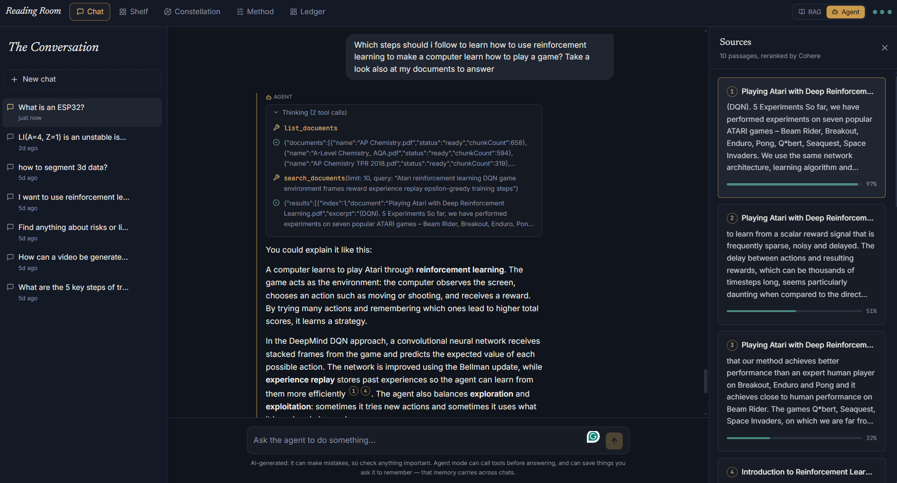
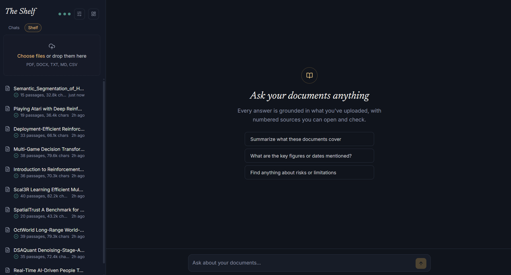
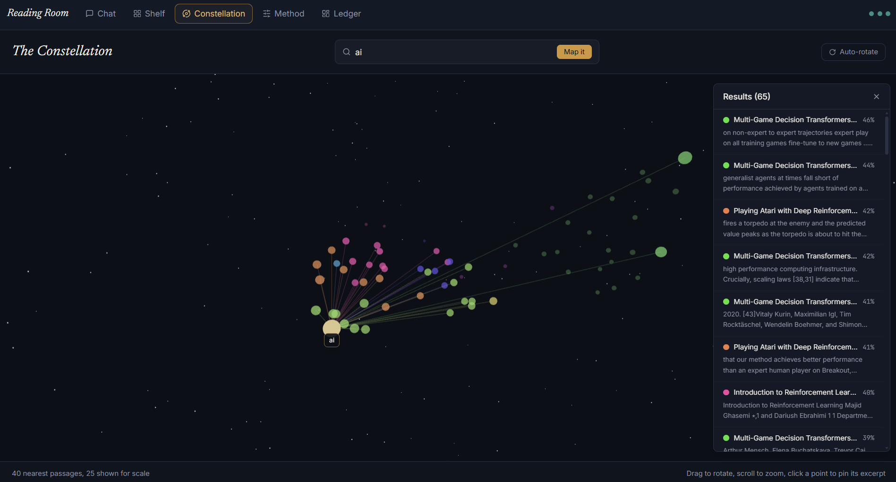
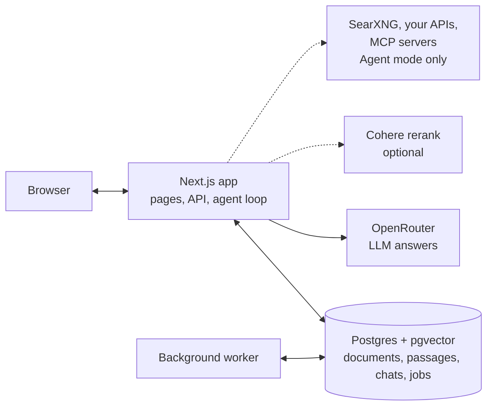
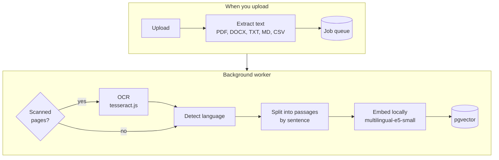
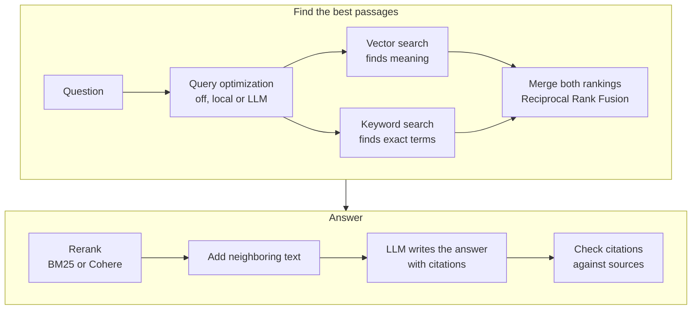
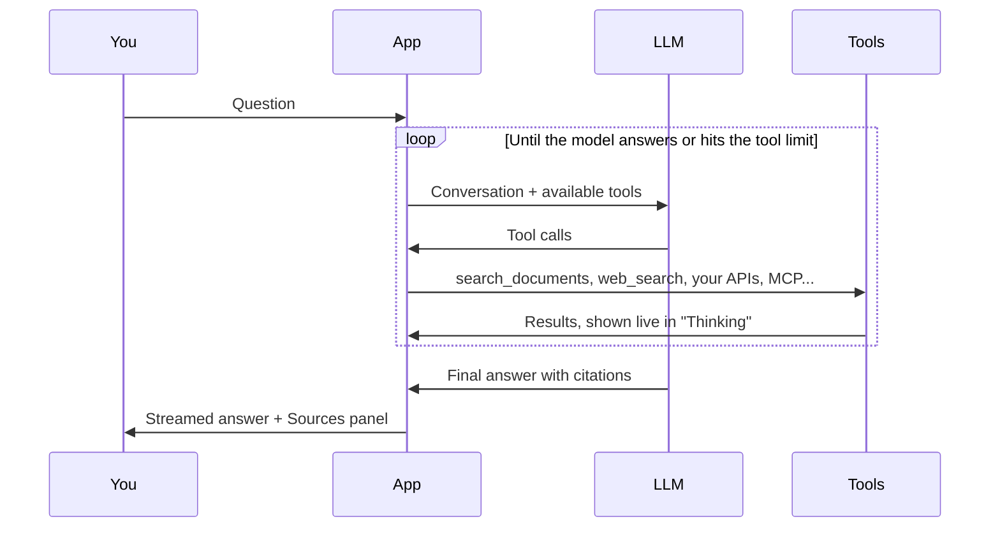
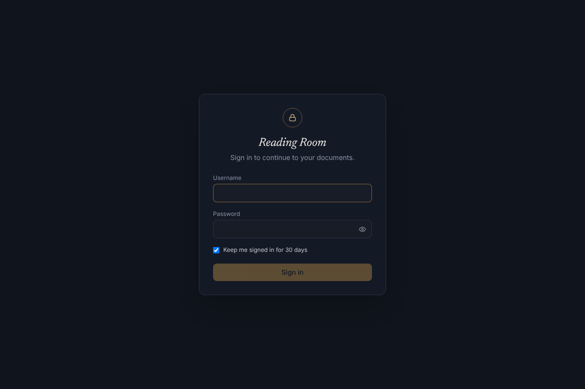

# Reading Room

**Chat with your documents.** Upload PDFs, Word files, text, Markdown or CSV,
then ask questions in any language. Every answer comes with clickable
citations to the exact passage and page it came from.

Two ways to answer:

- **RAG**: retrieve the best passages, then answer. Usually one API call.
- **Agent**: the model calls tools in a loop before answering. Tools include
  document search, web search, a calculator, memory, your own HTTP APIs and
  MCP servers.

Embeddings, OCR, keyword search and reranking all run locally, so the only
paid call is the LLM (via [OpenRouter](https://openrouter.ai), with free
models by default).



## Contents

- [Features](#features)
- [Quick start with Docker](#quick-start-with-docker)
- [Running without Docker](#running-without-docker)
- [Configuration](#configuration)
- [How it works](#how-it-works)
- [Cost](#cost)
- [Security](#security)
- [Development](#development)

## Features

### Chat

- **Answers stream in with citations** like `[1]` `[2]`. Click one to open
  the Sources panel with the exact passage, its document, page and relevance.
- **Rich answers**: tables, charts (bar, line, headline numbers), Mermaid
  diagrams, callouts, highlighted code, and math/chemistry notation (KaTeX).
- **Search in**: limit a question to some of your documents.
- **Citation check**: claims and figures that don't appear in the cited
  passages are flagged under the answer, to double-check.
- **Every chat has its own URL** (`/chat/<id>`). Chats can be pinned,
  renamed and deleted.
- **Stop**, **copy**, and **edit your last message**. Earlier versions of an
  edited message stay browsable.
- **Voice**: dictate with offline Whisper running in the browser, and have
  answers read aloud.
- **Long chats are compacted**: older messages are summarized for the model,
  while the full history stays on screen.
- Each answer shows its mode, number of LLM calls and time taken.

### Agent mode

Switch between **RAG** and **Agent** in the top bar. The mode is chosen per
message, so one chat can mix both.

| Tool | What it does |
|---|---|
| `search_documents` / `list_documents` | Searches or lists your documents, within the "Search in" choice |
| `web_search` | Web search through a [SearXNG](https://docs.searxng.org/) instance (optional) |
| `calculator`, `current_datetime` | Exact arithmetic, and the date and time in any timezone |
| `remember`, `list_memories`, `forget` | Memory that lasts across chats, also editable in Settings |
| Your tools | HTTP APIs and MCP servers, set up under [Integrations](#integrations) |

The model's tool calls show live in a **Thinking** panel and are saved with
the answer. A per-turn limit on tool calls (default 6) keeps costs bounded.
Pick a model that supports tool calling: Settings marks them, and a banner
warns you when the current model doesn't.

### Integrations

Under **Method → Integrations**:

- **API connections**: a base URL plus auth (Bearer token, header or query
  key), shared by many tools. Secrets stay on the server.
- **OpenAPI import**: paste or link a spec, pick the operations you want, and
  each one becomes a tool.
- **Custom tools**: an HTTP method, a URL template with `{param}`
  placeholders, and parameters. A **Test** button runs one exactly as the
  agent would.
- **MCP servers** over Streamable HTTP or SSE. You can switch individual
  tools off.

### The Shelf: your documents



- Drag and drop files. **Indexing happens in the background** with a progress
  bar on each document, and keeps going if you close the tab. Failed
  documents get a Retry button.
- **Scanned PDFs are OCR'd** offline, and only the pages without a text
  layer. Languages are set with `OCR_LANGUAGES` (default English and Italian).
- **Page numbers** are kept for PDFs and shown on citations.
- **Any language**: each document's language is detected, and a question in
  one language finds passages in another.
- Filter, sort and rename documents. **Group similar** clusters documents by
  content, with no categories to set up.

### The Constellation: a map of meaning



Type a word or phrase and see it placed in 3D among its closest passages,
projected from the embedding space with UMAP. Each document has its own
color, and clicking a point shows its text.

### The Ledger: usage and timing


- Documents, passages and answers stored.
- API calls and tokens per provider, against limits you can edit. Rings in
  the top bar show the same thing at a glance.
- How often each passage and each tool gets used.
- Time per pipeline stage, with a 14-day trend.

### The Method: settings

Seven tabs:

- **General**: model, query optimization and reranking.
- **Agent**: tool limit and web search.
- **Integrations**: connections, tools and MCP servers.
- **Memory**: what the agent remembers.
- **Voice**: Whisper model and read-aloud voice.
- **Data**: export and import everything as one JSON file.
- **Danger zone**: delete chats, documents, memory or usage history. Each
  action asks you to type a confirmation.

Changes save immediately.

## Quick start with Docker

You only need [Docker](https://www.docker.com/products/docker-desktop/). This
runs the app and a Postgres database (with pgvector) on
**http://localhost:3880**.

```bash
cp .env.example .env.local    # add your OPENROUTER_API_KEY
docker compose up -d --build
```

The first build takes a few minutes, and includes downloading the embedding
model. On every start, the app updates the database schema automatically.

| Task | Command |
|---|---|
| Logs | `docker compose logs -f app` |
| Update after `git pull` | `docker compose up -d --build` |
| Stop (data is kept) | `docker compose down` |
| Stop and **delete all data** | `docker compose down -v` |

- Settings come from `.env.local`, except the database, which is the bundled
  one. To use another database, such as Supabase, put
  `DOCKER_DATABASE_URL=...` in a `.env` file next to `docker-compose.yml`.
- Services running on your computer (e.g. SearXNG) are reachable at
  `http://host.docker.internal:<port>`.
- The port is only reachable from your own computer. To open it to your
  network, change it to `"3880:3880"` in `docker-compose.yml` and set
  `APP_PASSWORD`.
- To move data from another install, use **Method → Data → Export** there
  and **Import** here.

## Running without Docker

You need Node 20+ and a Postgres database with pgvector, such as a free
[Supabase](https://supabase.com) project. If you use Supabase, take the
"Transaction pooler" connection string, on port 6543.

```bash
npm install
cp .env.example .env.local    # set DATABASE_URL and OPENROUTER_API_KEY
npm run db:migrate            # creates or updates the schema; run after every pull
npm run dev                   # http://localhost:3000
```

Upload a document on the Shelf, wait until it's **ready**, then ask away.

## Configuration

Set these in `.env.local` (see `.env.example`):

| Variable | Required | What it's for |
|---|---|---|
| `DATABASE_URL` | yes (not with Docker) | Postgres with pgvector |
| `OPENROUTER_API_KEY` | yes | Generating answers ([get a key](https://openrouter.ai/keys), free models need no card) |
| `OPENROUTER_MODEL` | | Starting model. After the first run, the model is set in Settings |
| `COHERE_API_KEY` | | Cohere reranking. Without it, free local BM25 reranking is used |
| `SEARXNG_BASE_URL` | | Enables the agent's web search |
| `APP_PASSWORD`, `APP_USERNAME` | **anywhere but your own computer** | Requires signing in (username defaults to `admin`) |
| `APP_SESSION_SECRET` | | Keeps sessions valid across password changes |
| `EMBEDDING_MODEL` | | Default `Xenova/multilingual-e5-small`. Changing it re-embeds every document |
| `OCR_LANGUAGES` | | Default `eng+ita`. For more, install `@tesseract.js-data/<code>` |
| `MAX_UPLOAD_MB` | | Per-file limit, default 25 |
| `DISABLE_BACKGROUND_WORKER` | | Set to `1` and run `npm run worker` separately, e.g. on serverless hosting |
| `ALLOW_MCP_STDIO` | | Allows MCP servers that run as local commands |

**Web search** needs a SearXNG instance with JSON output enabled. Public
instances usually disable it, so self-host one:
`docker run -p 8080:8080 searxng/searxng`, then add `json` to
`search.formats` in its `settings.yml`.

## How it works


```mermaid
flowchart LR
    B["Browser"] <--> A["Next.js app<br/>pages, API, agent loop"]
    A <--> DB[("Postgres + pgvector<br/>documents, passages, chats, jobs")]
    W["Background worker"] <--> DB
    A --> OR["OpenRouter<br/>LLM answers"]
    A -.-> CO["Cohere rerank<br/>optional"]
    A -.-> EXT["SearXNG, your APIs,<br/>MCP servers<br/>Agent mode only"]
```

### Indexing a document

Uploading only reads the file. Everything else happens in a background
worker, through a job queue stored in Postgres. Failed jobs are retried, and
work survives restarts.


```mermaid
flowchart TB
    subgraph up["When you upload"]
        direction LR
        U["Upload"] --> X["Extract text<br/>PDF, DOCX, TXT, MD, CSV"] --> Q[("Job queue")]
    end
    subgraph bg["Background worker"]
        direction LR
        O{"Scanned<br/>pages?"} -- yes --> OCR["OCR<br/>tesseract.js"] --> L["Detect language"]
        O -- no --> L
        L --> C["Split into passages<br/>by sentence"] --> E["Embed locally<br/>multilingual-e5-small"] --> V[("pgvector")]
    end
    up --> bg
```

### Answering a question (RAG)


```mermaid
flowchart TB
    subgraph find["Find the best passages"]
        direction LR
        Q["Question"] --> QO["Query optimization<br/>off, local or LLM"]
        QO --> VS["Vector search<br/>finds meaning"] --> F["Merge both rankings<br/>Reciprocal Rank Fusion"]
        QO --> KS["Keyword search<br/>finds exact terms"] --> F
    end
    subgraph answer["Answer"]
        direction LR
        R["Rerank<br/>BM25 or Cohere"] --> N["Add neighboring text"] --> G["LLM writes the answer<br/>with citations"] --> CC["Check citations<br/>against sources"]
    end
    find --> answer
```

- **Hybrid search** combines vector search, which finds paraphrases, with
  Postgres full-text search, which finds names, codes and rare words. Keyword
  search uses each document's own language for word stemming.
- **Neighboring text** around each passage is added, because the answer
  often sits just across a passage boundary.

### Agent mode


```mermaid
sequenceDiagram
    participant U as You
    participant A as App
    participant M as LLM
    participant T as Tools
    U->>A: Question
    loop Until the model answers or hits the tool limit
        A->>M: Conversation + available tools
        M->>A: Tool calls
        A->>T: search_documents, web_search, your APIs, MCP...
        T->>A: Results, shown live in "Thinking"
    end
    M->>A: Final answer with citations
    A->>U: Streamed answer + Sources panel
```

## Cost

With the default settings, a RAG answer costs **one OpenRouter call**:

| Step | Default | Alternatives |
|---|---|---|
| Embeddings | Local | — |
| Search | Your Postgres | — |
| Query optimization | Local NLP | Off, or LLM (+1 call) |
| Reranking | Local BM25 | Cohere (+1 Cohere call), or off |
| Answer | 1 OpenRouter call | — |

Agent mode makes one OpenRouter call per round of tool use, plus the final
answer. Long chats make one extra call about every 24 messages, to compact
the history. Calls are paced under each provider's per-minute limit, and the
Ledger shows exact counts.

## Security



- **Set `APP_PASSWORD`** whenever the app is reachable by anyone but you.
  Every page then requires signing in, and API requests without a session
  are refused.
- **Sessions** use a signed cookie (HttpOnly, SameSite, Secure over HTTPS)
  that lasts 12 hours, or 30 days with "Keep me signed in". Changing the
  password signs everyone out, unless `APP_SESSION_SECRET` is set.
- **Brute-force protection**: 5 wrong passwords from one address lock it out
  for 15 minutes. Attempts are stored in the database.
- **Tool calls can't reach your private network** (localhost, LAN, cloud
  metadata addresses), including through DNS tricks and redirects. Allow it
  per connection only when you need to.
- **Treat tool results as untrusted**: a web page or API response can try to
  steer the model. Connect only services you trust.
- Serve over HTTPS anywhere other than localhost.

## Development

```bash
npm test             # unit tests
npm run typecheck
TEST_DATABASE_URL=postgresql://... npm test   # also the database tests (needs pgvector + migrations)
npm run eval         # retrieval quality: hit@1, hit@5, MRR for each settings combination
```

- **Migrations** are in `db/migrations/` and are applied by
  `npm run db:migrate`. Use that rather than `db:push`, which doesn't work
  with Supabase's pooler.
- **Retrieval eval**: copy `eval/questions.example.json` to
  `eval/questions.json` and write questions about your own documents.
- **CI** runs migrations, typecheck, all tests (including the database ones)
  and a production build on every push and pull request.

**Built with** Next.js 14, Postgres + pgvector (Drizzle), transformers.js,
tesseract.js, the Vercel AI SDK, OpenRouter, Mermaid, KaTeX and three.js.
